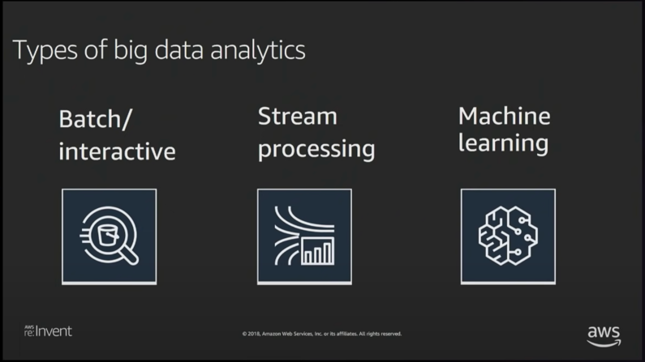
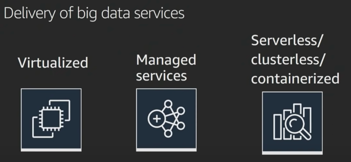
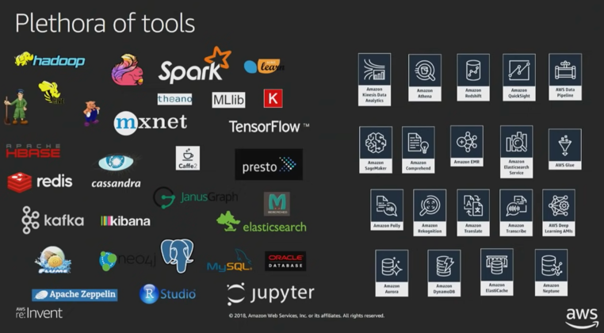
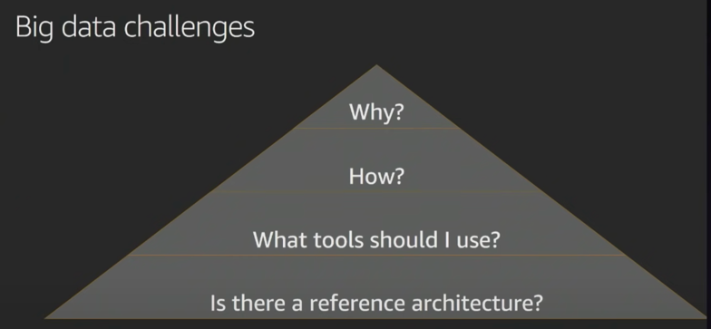

  
There are different kind of analytical systems. 
Some customers are looking at doing batch-interactive analytics with their data. 
Others are looking at being able to to take real time data feeds, and store them for insights, and some go beyond, seking building of data models on top of it, power inferencing and do ML with that data. 

As we step step into the architecture discussion, we are going to discuss architecture for -> 
- Streaming procesisng 
- datalakes and batch interaction 
- machine learning. 

Note - you dont need to pick them right away. You can start small, architect it in a way that it enables you to build more and more features on top of it over time, incrementally. 

Now, lets look at different model of delivering big data services. 
 

Virtualized - eg- EC2 instances that we create & install kafka on top of it. Customer owns environment and manages it themselves. 
Managed Services - EMR (hadoop platform as a service), RDS - managed by AWS - customers still thinking about requirements like what configuration you need, what should be auto-scaling policy etc. 
Serverless/Clusterless/Containerized - Lambda, Athena, Glue - tehse are services that abstract out the servers away from you. 

Various services - both open source and AWS based are mentioned below - 
 

Going forward we will discuss -> 
* different kind of reference architectures. 
* what tools should one choose? 
* How? 
* Why? 
 