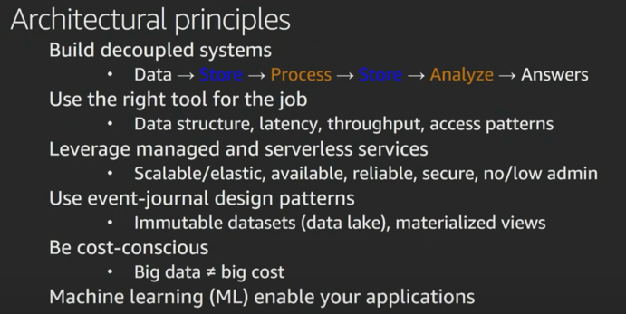
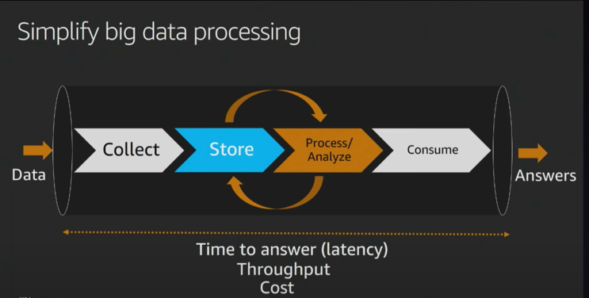
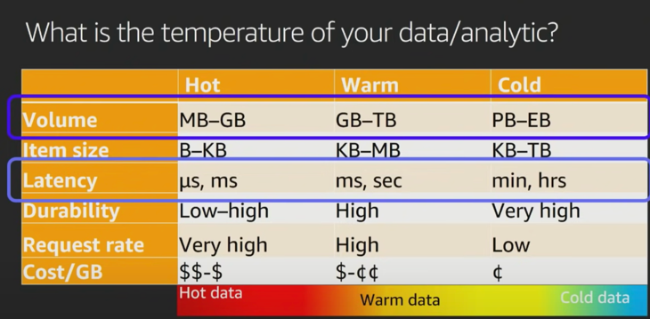

# Big Data Architectural Principles

 

1. build loosely coupled or decoupled system.  
This holds true not just for Big Data Systems, but for any system.  
This means - the way I collect my data shouldn't be dependent on the way I analyze my data.  
So, I could change the way I collect my data by changing the tool and it shouldn't be impacting the way I store, process and/or analyze my data.  
This lets you be future-proof, lets you iterate, and lets you migrate over time.   

2. Being able to pick right tool for the right Job.  
If your system is loosely coupled, it gives you flexibility to pick right tool for right Job.  
Rather than trying to pick one tool to do everything, choose one which fits your use case.  
Eg-   
   a. for streaming you an use Kafka, AWS Kineses  
   b. for ML - sagemaker  
   c. for storage - RDS, HDFS/S3 etc   

3. Leverage managed and serverless services -  
Not an architectural principle, but more of a recommendation.  
By leveraging managed and serverless services, you can focus on what really matters.  
It lets you focus on analytics, the transformations, the ETL, rather than loading softwares and other pieces.   

4. Use event-journaling design Patterns -  
It means as you are collecting data into big data systems its a good practice to not override your data.  
So, if you are getting data records, and some of those data records are getting corrected, then rather than correcting those records, keep appending to your dataset.  
Why - if you have large volume of data, and if there is ever an issue like ->  
   i. your job has a bug, Or  
   ii. you accidently delete your data,
 ...you have the option to replay history and regenerate your data.  
 So, go for immutable datasets (data lake), materialized views.   

5. Be cost-conscious  
Lot of times, big data doesnt have to mean big cost.  
If you architect it correctly, say you are building a hadoop system and are decoupling storage and processing layers, you can build a very cost effective, performant system, and keep the cost down.   

6. Use ML to enable you applications.  
This is a growing trend wherein more and more companies are leveraging ML to build their competitive advantages.  

## A simplified data processing pipeline
Below, we see simplified data processing pipeline.  
 

Your exact use case may not match it, but you should look at logical constructs here. 

for example, in  Collect layer, you need to ask questions like -> 
- How am I gonna capture and collect this information? 
- If I have different datasets, I may not be collecting and storing these datasets in the same way. 
- If I have GPS data or clickstream data, I would like to collect it differently from imagery or satellite data. 

You must also note there is a cycle here. 
Its not exactly a waterfall model.  
Often times you collect and store raw data, and that raw data is in original form like csv, json etc. 
Then you often times would like to take that raw data and create curated datasets - query optimized datasets to be able to very rapidly access that data.  
This could be through ML, Data warehousing etc.  
This is a iterative process wherein you take raw data, and pass it through various transformations processes, and convert it to normalized/de-normalized form in order for it to be consumed by different stakeholders. 

## What is the temperature of my data?

Often times we talk about temperature of your data, that means velocity of your data, your queries and your analytics. 
We will discuss about temperature across those spectrums. 