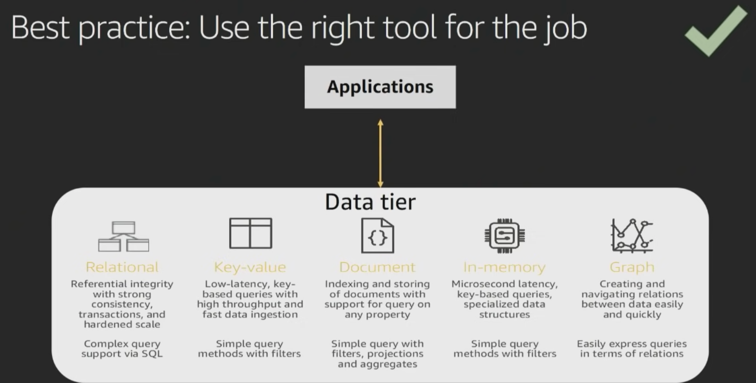

## Collect Layer

### Types of data sources
 
In collection phase, often times you have different data sources -> 
- transactional databases like relational databases, MongoDB, or NOSql database. 
Often times these are records that you need to be able to analyze and process. 
We can call those **Transactions** 
- Similarly, you might have log data like Media files, Application Log files. 
These are large **Files/Objects** that you may be needing to store. 
- Finally, we have streaming data like device sensors, IoT platforms. 
These are **Events** data. 

Each of those collections methods often require different way of collecting of data. 

And, often times, storing these data is also different.  
For Transactional data, it usually goes into NoSQL or relational database. 
(we will discuss the criteria for this). 
For Files/Objects data, the defacto standard is HDFS/S3 - we need a big object store for which datalake based on HDFS/S3 is needed. 
For stream storage, we have 3 main options -> 
- Apache Kafka  
  - open source project. 
  - well established. 
  - High throughput distributed streaming platform. 
  - so a client which wants to migrate their data can begin by moving over their kafka systems to ec2. 
- Amazon Kinesis Data Streamings  
  - Managed Stream **storage** 
  - for example, here we define number of shards, and each shard pcoesses a 1000 records/seconds.  
  Say, you wanna scale up to 100,000 records, you would only need to change the number of shards required, and not be worried about number of servers being used, etc. 
- Amazon Kinesis Data Firehose 
  - Managed **data delivery**  
  - lets say you have streaming data, and instead of capturing real time insights, you want to capture that data, and do some sort of advanced processing or offline procesing of that data. 
  - here AWS Kinesis Firehose comes into picture. It allows you configure an end point to be abel to store thet data. This could be S3 bucket (data lake) or Elastic Search (ELK Stack).  
  This allows you to configure various destionations in order to store the data as the data is flowing in. 
  In data streams you configure number of shards. 
  In firehose, its purely based on amount of data that is sent though that pipe.  
    - So, you dont have hvae to pre-provision, but there are soft limits to amount of data to be processed per second. 

### Which Streaming/Message Storage should I use?
 

SQS (Simple Queue Service) Vs Streaming Storage -> 
- If your use case if a simple producer and single consumer - go for SQS. 
- If yours is a case of complex architecture wherein you have multiple consumers and also want to store stream data, opt for Stream Storage. 

### Which File/Object Storage should I use?

 
Here S3/HDFS are defacto standards. 

1. S3 allows you to build your data lake in a robust manner. 
You can run various analytics on it. 
Its natively supported by wide number of tools including hadoop ecosystem  like HDFS, presto, hive etc can talk to S3 to be able to read and process that data. 

2. Decouple Storage and Compute 
- no need to run compute clusters for storage (**unlike HDFS**) 
  - S3 is cheap ~ Storage & EMR for compute 
  - in HDFS, you need to keep cluster always on. 
- can run transient Amazon EMR clusters with  Amazon EC2 spot instances. 
- multiple & heterogenous anlaysis clusters  and servcies can use the same data. 
  - consider a scenario wherein you ingest data into S3. Now since storage si separated from compute, youcan run different clustes on top of same source of data. 
  For example, one load can be of spark on EMR(based on reserved instances), and other for GPUs (based on spot instances) 

3. Designed for 99.999999999 % durability (11 Nines). 
Tremendous data reliability. 

4. Data replication within the same region is done automatically. 

5. Security - it used encryption at rest and in transit both. 

#### Data Tiering
 
Its about maintaining data in different tiers based on use case. 

Use of s3 implies no use of HDFS? 
No. One can store their working datasets like quick analysis intermediate data in HDFS for faster access. 
For example, say you to do some analysis on data that involves iterative reads, and here you can use HDFS storage on EMR cluster. 

AWS gives S3 analytics report that recommends which object should be placed in which tier. 

Now, lets talk about databases. 
 
When it comes to databases, we have large number of options based on purpose. 

|Purpose|Database |
|caching|AWS elasticCache, DynamoDB Accelerator|
|Graph DB | Amazon Neptune|
|Key-value document| Amazon DynamoDB|
|SQL/RDBMS|Amazon RDS (Relational Database Service)|

Amazon DynamoDB Accelerator (DAX) - its a dynamoDB Front end which has a write-through cache. 

### Which Store should I use?
 

Choosing a right database involves asking right questions, including -> 
- what is the Data Structure ? 
- How will data be accessed? 
- What is the temperature of the data? 
- what will be solution cost? 

 

 

What is the data structure? 
- Do I have a very fixed schema? 
- am I doing key-value lookups -> eg - we have tons of session data, and we can use dynamoDB or key-value store. 
- is it very very relational data such that you are constantly traversing  the graphs 

Also data access pattern is important. 
eg-  
- amazon aurora - very very high throughput transactional data need 
- if you need analytical capability of OLAP then use Amazon Redshift. 

 
