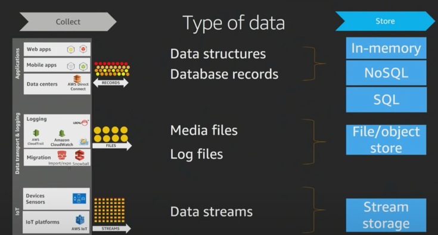
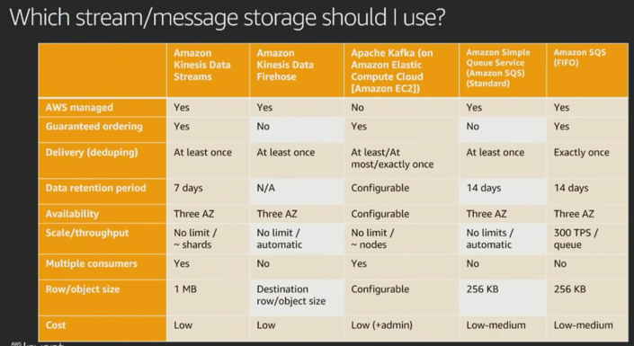
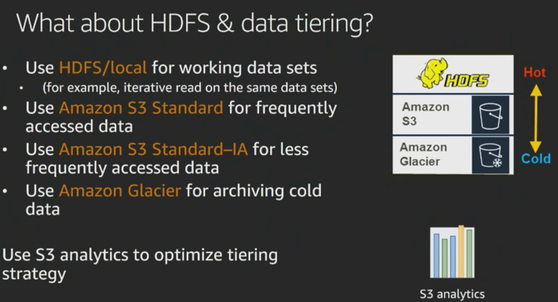

## Collect Layer

### Types of data sources
 

In Collection, you need to figure out the type of data you are collecting.
Often times you have different data sources -> 
- transactional databases like relational databases, MongoDB, or NOSql database. 
Often times these are records that you need to be able to analyze and process. 
They come in the form of Web applications, Mobile Applications, Data Centres, etc. 
We can call those **Transactions** 
- Similarly, you might have log data like Media files, Application Log files. 
These are large **Files/Objects** that you may be needing to store. 
- Finally, we have streaming data like device sensors, IoT platforms. 
These are **Events** data. 

Each of those collections methods often require different way of **collecting** of data. 

And, often times, **storing** these data is also different.  
For Transactional data, it usually goes into NoSQL or relational database. 
(we will discuss the criteria for this). 
For Files/Objects data, the defacto standard is HDFS/S3 - we need a big object store for which datalake based on HDFS/S3 is needed. 

#### Stream Storage
For stream storage, we have 3 main options in AWS -> 
  
**Amazon Kinesis Data Streaming**
  - Managed **Stream storage** 
  - for example, here we define number of shards, and each shard processes a 1000 records/seconds.  
  Say, you want to scale up to 100,000 records, you would only need to change the number of shards required, and not be worried about number of servers being used, etc. 
  - Thus, **Kinesis is truly serverless**. Where you provision your streams, and specify only shards, and not resources etc. 
  - Kinesis allows real-time analytics.
 
**Amazon Kinesis Data Firehose**
  - Managed **data delivery**  
  - Let's say you have streaming data, and instead of capturing real time insights, you want to capture that data, and do some sort of advanced processing or offline processing of that data. 
  - Here AWS Kinesis Firehose comes into picture. It allows you configure an end point to be able to store that data. This could be S3 bucket (data lake) or Elastic Search (ELK Stack).  
  This allows you to configure various destinations in order to store the data as the data is flowing in. 
  Think of it as a pipe wherein you specify th end-point and that becomes your target location from where you fetch data for your analytics. 
  In data streams you configure number of shards. 
  In firehose, its purely based on amount of data that is sent though that pipe.  
    - So, you dont have hvae to pre-provision, but there are soft limits to amount of data to be processed per second. 

**Amazon Managed Streaming for Apache Kafka (Amazon MSK)**
- This is Amazon managed Kafka service, wherein you can setup kafka cluster with a few clicks.
- Here AWS manages Kafka cluster, including Zookeeper.

In open source we have **Apache Kafka**  
    - open source project. 
    - well established. 
    - High throughput distributed streaming platform. 
    - so a client which wants to migrate their data can begin by moving over their kafka systems to ec2. 

### Which Streaming/Message Storage should I use?
 

SQS (Simple Queue Service) Vs Streaming Storage -> 
- If your use case if a simple producer and single consumer - go for SQS. 
- If yours is a case of complex architecture wherein you have multiple consumers and also want to store stream data, opt for Stream Storage. 

### Which File/Object Storage should I use?
Here S3/HDFS is the defacto standard. 
S3 allows you to store and retrieve any amount of data.  

#### S3 as Datalake storage 
 
One of the main use case for S3 is to use it as the centre of your data lake. 
There are a number of reasons for it.  

1. It is natively supported by wide number of tools including hadoop ecosystem  like HDFS, presto, hive etc can talk to S3 to be able to read and process that data. 

2. Decouple Storage and Compute 
- S3 allows you to decouple storage and compute, and this is really powerful.  
  - by having your storage outside of the hadoop ecosystem, it allows you to run transient clusters over your dataset.  
    Transient clusters are short-lived. You could introduce steps that involves starting your cluster, processing your data, write output to S3, and terminate the cluster.  
    What is the benefit here? 
    - First, Cost - you pay for what you use.
    - Second, it gives scope for innovation & Flexibility.  
    For example, multiple & heterogenous anlaysis clusters  and services can use the same data. 
    In case of spark processing, you could use EC2 instances which are memory optimized. 
    At the same time, you could also have GPUs to run tensorflow and ML on same dataset.
    You could  run spark on EMR(based on reserved instances), and other for GPUs (based on spot instances).

3. Designed for 99.999999999 % durability (11 Nines). 
Tremendous data reliability. 
Data replication within the same region is done automatically. 
this makes S3 durable.

4. Security - it used encryption at rest and in transit both. 

5. Low Cost - its cost effective. One of the ways to optimize S3 is to use Data Tiers (discussed in next section).  

#### Data Tiering
 

The data that you are accessing frequently should be placed in Amazon S3.
S3 gives you the option (**S3 Standard-IA**) to move your data to move data infrequent access layers, and this is where you save cost. 
There is also **Amazon Glacier** which is a cold storage, and is the data not available for doing analytics - data is stored in Archive. (In S3 Standard-IA, you can do analytics, but here the pricing works frequently.) 

If I have data in s3, do I still need HDFS? 
Maybe. 
One can store their working datasets for analysis in HDFS (in EMR cluster) for faster access instead of accessing them from S3. 

### What about Metadata?
In order to fully decouple your storage from compute, data is one part of equation, and metadata is other part.
You need to have both outside the cluster in order to use the transient EMR cluster. 

**AWS Glue Catalog** 
It is a fully managed data catalog, and is Hive metastore compliant. 

Search metadata discovery - What is the purpose of Glue Catalog? - It aims to serve as Unified Data Catalog across all the sources on which you want to do data catalog on. 
Amazon Athena, Amazon EMR, Amazon Redshift Spectrum - all these are integrated with the Glue Catalog.  

Glue also has utility - Crawlers - which is an application that you can point to your data sources (S3, RDBMS etc), and it will explore the data, and will try to identify teh metadata for you so thaht you create those tables to make it easier to find those schemas. 
So Crawlers used to Detect new data, schema, partitions. 

**Lakehouse Formation** 
When it comes to datalake, you still have to go to a few places to create - S3 (storage), Metadata(Glue Catalog), IAM (security access), etc. 
Lake-formation comes to help you to create a Datalake in AWS within a few minutes. 
It enhances those services with additional metadata, and will also introduce additional data quality jobs that can do task like de-duplication, fina matches where there is no matching id, etc. 

**Hive Metastore** 
If you don't want to go with AWS Glue, then can host your own Hive Metastore on Amazon RDS. 

### Cache & Database
Now, lets talk about databases. 
 
When it comes to databases, we have large number of options based on purpose. 

| Purpose            | Database                                       |
|--------------------|------------------------------------------------|
| Caching            | - AWS elasticCache  - DynamoDB Accelerator |
| Graph DB           | Amazon Neptune                                 |
| Key-Value document | Amazon DynamoDB                                |
| SQL/RDBMS          | Amazon RDS (Relational Database Service)       |

Amazon DynamoDB Accelerator (DAX) - its a dynamoDB Front end which has a write-through cache. 

From Analytics point of view, Database can be source of data from which we pull the data for doing analytics.  
It can also be target of your analytics, wherein you want to push results of your analytics to your database so that you can have some real-time dashboard. 

### Which Store should I use?
 

Choosing a right database involves asking right questions, including -> 
- what is the Data Structure ? 
- How will data be accessed? 
- What is the temperature of the data? 
- what will be solution cost? 

 

 

Main 2 questions are about what is my data structure and how I will access my Data.  
What is the data structure? 
- Do I have a very fixed schema? Then SQL is the way to go, especially you have complex relationships involving Table joins, and this is the way you access the data. 
- If your data is not having fixed schema, you should consider NoSQL database.
- If your latency requirements is sub-seconds, then you should consider having in-memory Cache in front of your database/NoSQL system.
- is it very relational data such that you are constantly traversing  the graphs 

Also data access pattern is important. 
eg-  
- amazon aurora - very high throughput transactional data need 
- if you need analytical capability of OLAP then use Amazon Redshift. 

 