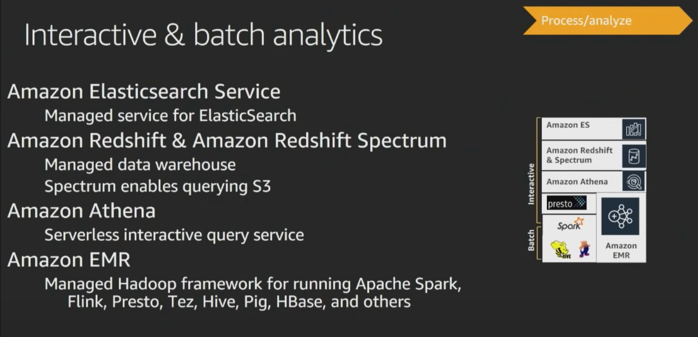
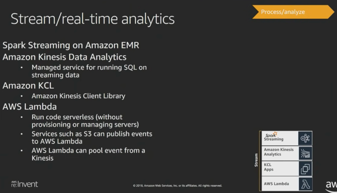
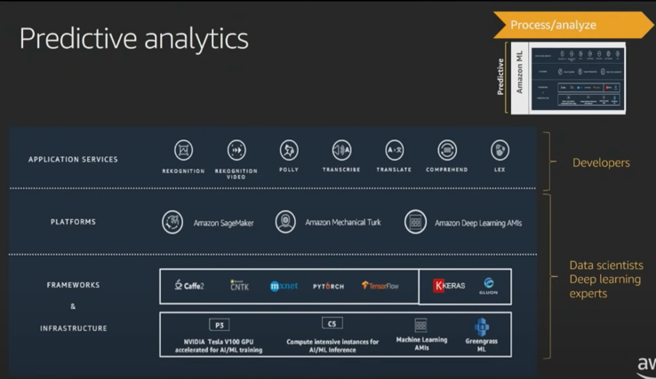
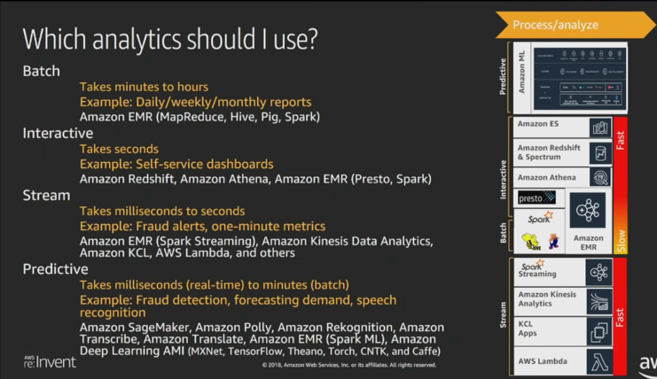
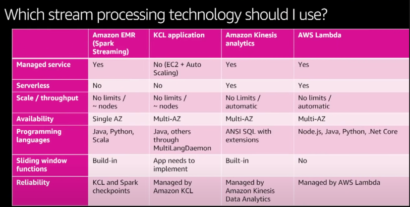
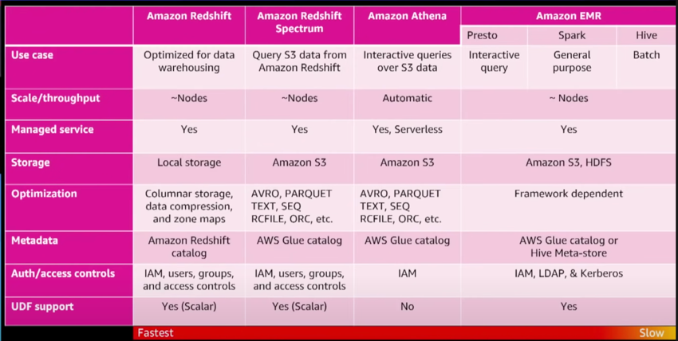
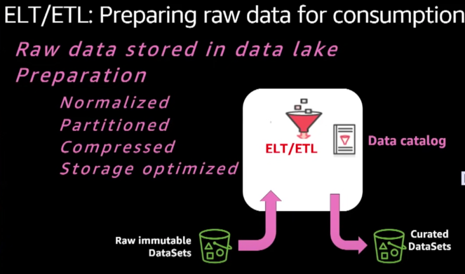
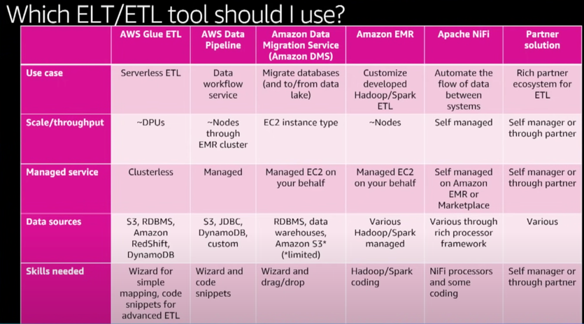

## Data Processing Layer
 

We will highlight various available services in AWS and their use cases. 

### Interactive & Batch Analytics
First, let's look at interactive & batch analytics.  
  

- Amazon Elastic Search Service  
  - Ir is a managed service for Elastic Search. 
  - Elastic Search clusters can be spun up in minutes. 
  - Strongest **use case** is Log Analysis, wherein you have dashboard based on ELK (elastic search & Kibana) stack.  
  - Other **use case** is in datalake is metadata indexing. Since Elastic Search is a search, it will allow you query with some search - give search experience your queries. You could index your metadata to elastic search, and have an additional search ability over your data sources in a datalake.  
- Amazon Redshift & Redshift Spectrum 
  - for data warehousing needs. Redhsift is a fully managed Data Warehouse.  
  - AWS Redshift is an OLAP system. Its an **MPP (Massively Parallel Processing) System**.   
    - It will allow us to query terabytes of data.  
    - Its a schema on read kind of system, wherein you define Schema first and put in a highly structured data.  
  - Redshift Spectrum enables querying S3.  
- Amazon  Athena ~ Hive  
  - It is Serverless interactive query service. 
  - Performs SQL based queries on Data that resides on S3.  
  - Similar to Presto/Hive.  
  - S3 Select 
    - is somewhat similar to Athena, but there are some differences.  
    - You can think about AWS S3 Select as a cost-efficient storage optimization that allows retrieving data that matches the predicate in S3 and glacier aka push down filtering.   
    - AWS Athena is fully managed analytical service that allows running arbitrary ANSI SQL compliant queries - group by, having, window and geo functions, SQL DDL and DML.  
    - Athena works on logical object selecting its information from AWS Glue Catalog rather than selecting data out of an object on S3.  
    - S3 Select works on object out of S3 bucket.
- Amazon EMR  
  - Its Hadoop & Spark as a Service that lets you run various platform applications.  
  - one thing special about EMR is that you have root access to EC2 instances that EMR is using unlike other managed services.  
    eg - in RDS, you ENIN point that allows you to perform database functions, but you cannot do SSH on it.  

### Streaming/Real-time Analytics
  

In Streaming analytics we have a number of options.
1. Spark Streaming on Amazon EMR.
2. Amazon Kinesis Data Analytics -
   1. Its ia managed service for running SQL on streaming data.
3. Amazon KCL
   1. You can always create your own application by using Amazon Kinesis Client Library.
4. Amazon Lambda
   1. Run code serverless (without provisioning or managing servers).
   2. Services such as S3 can publish events to AWS Lambda.
   3. AWS Lambda can pool events from a Kinesis.

If you look at Hadoop ecosystem, the number of services that perform real-time analytics has been growing - Spark Streaming, Flink, Storm.   
Just like Athena allows you to perform SQL queries on S3 even though it is not a relational database, AWS Kinesis Data Analytics allows you to perform SQL queries on your real time data even though it is not really a database.  
So you could write SQL - tumbling windows, random cut forest, different sort of expressions to analyze data, and under the hood it will be working on real-time data feeds, and sending back the output.   

As a customer one key question that needs to be answered while picking a tool is - **'What is my end to end latency from point at which I publish a message to point at which I process the message and get final results?'** 

AWS Lambda lets you write functions, and set up an event trigger for Kinesis off of that.  
But, in respect to AWS Lambda, one thing to note is that it polls every second. 
That means if you are looking for sub-second latency, use other tool like Amazon KCL. 

### Predictive Analytics
  

Here you have the option to have 3 layers -
1. Frameworks
2. Platforms
3. Application Services

Frameworks
It is for ML Practitioners, wherein you get the bare machines with those frameworks pre-installed, and you have to do traditional Machine Learning tasks like hyper-parameter tuning, etc.

**Platforms**  
This layer allows us to build models and test them. 
Helps ML experts to dod tasks like giving them jupyter notebooks, familiar interfacce, and then you can use Sagemaker API to create instance models and then you can deploy the model.
Its one kind of place where you can do all ML tasks on the platform.

**Application Services**  
It is for developers who want to use ML in their aplication, but dont want to implement ML
So, we have some algorithm which are successful like NLP, and these can be integrated by calling these APIs.

Application services help built different types of ML algos on the platform. 
One thing is to note that make sure to write your data in **open standards** like orc, parquet, CSV or JSON.  
That ways you can use different tools with it for your use case.  

### Which Analytics should I use?

Batch analytics - think of it as a report that runs  daily/weekly/monthly.  
Tools - Amazon EMR, Hive/Spark.  

Interactive Analytics  
See it is a s self-service dashboard, wherein you want to get answers yourself from the system.  
Tools - Redshift, Athena, Amzon EMR on Spark/Presto.  

Stream Analytics  
In EMR, you can utilize Spark Streaming, Kinesis Data analytics services.  

Predictive Analytics  
It can be batch or streaming.  

   

### ETL
Often times data comes in raw form, and what you want to do is to create curated datasets or canonical datasets, that represent a normalized view of data.  
And that's where ETL process comes in.  
And that normalized dataset is often in format different from the one that came in.  
So, your raw data could be in JSON, CSV etc, and your output would often be a column oriented format(parquet/orc), or row-based format(Avro - handles schema changes better).  

One concern around ETL is that one loses value of data.
But in truth, ETL helps transform data in format that is more suitable for doing analytics - partitioning, converting form text to parquert/orc.

Below are AWS ETL options.  
 

##### AWS Glue ETL
Allows running spark/python shell.  
it is a serverless category wherein you abstract server complexity from user.  
you define data processing unit and schedule those jobs to run.  

##### Amazon Data Migration Service(DMS)
If you want to have CDC (Change Data Capture), then Amazon Data Migration Service(DMS) is an option.  
Glue isn't abl;e to do that, or you can look at CDC solution from partner services.  

