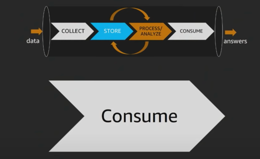
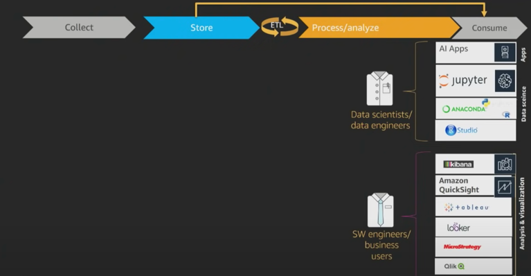

# Data Consumption Process

When it comes to consumption, we have 2 categories of users -
1. Business users - who want to make sense of data.  
The service here involved is applications like visualization applications like Tableau and Amazon Quicksight (amazon managed visualization tool), Kibana (visualization on elastic search). 

2. Data Scientist - They want to get access to an endpoint and play with data. They would like to use Athena, Redshift, etc. 

We could ask questions like what type of BI or UI one could use in this type of solution. 
Answer depends on who is user and what is the function they are doing.
Eg - 
Business user would not prefer to be asked to use Jupyter notebooks, nor would a data scientist enjoy being placed in front of dashboard with little flexibility to play around with data. 
In this stage, solutions you would find would be a suite of different UI being used to be able to perform these analytics. 

Jupyter - used in data science space. 
Sagemaker allows you to have a managed Jupyter environment, running both Jupyter and Jupyter Lab. 
You could also run managed Jupyter or managed notebooks on EMR. So, if you are looking at just Hadoop ecosystem, we have option of EMR or managed hadoop environment. 

ELK Stack - Kibana can allow doing Log analysis. 
There are also partner products like Splunk, Tableau, Looker and MircoStrategy. 