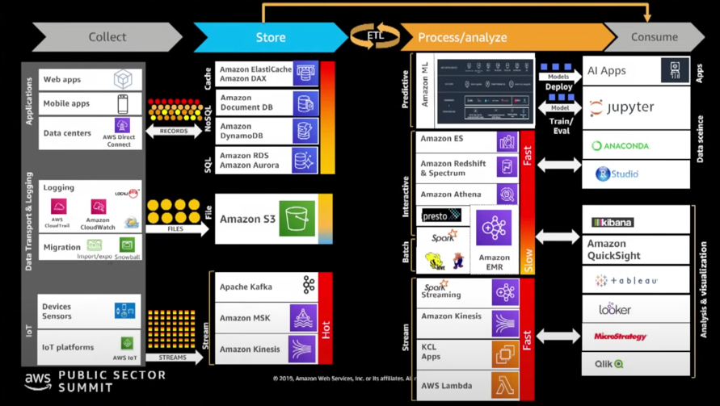

# Putting it all together

We have data from various sources flowing in. 
Different repositories based on requirements that are needed to store that data. 
One key call-outs we need to take note of is ETL process - How can I take my data, create it in the most consumable method for different types of users to be able to process and analyze that data, and ultimately getting it to derive insights and answer business questions, etc. 
