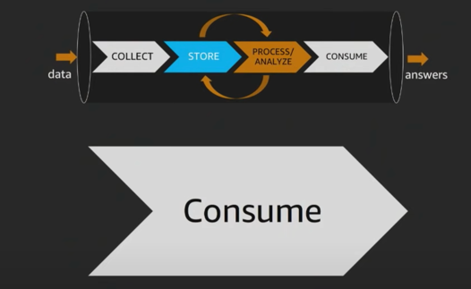
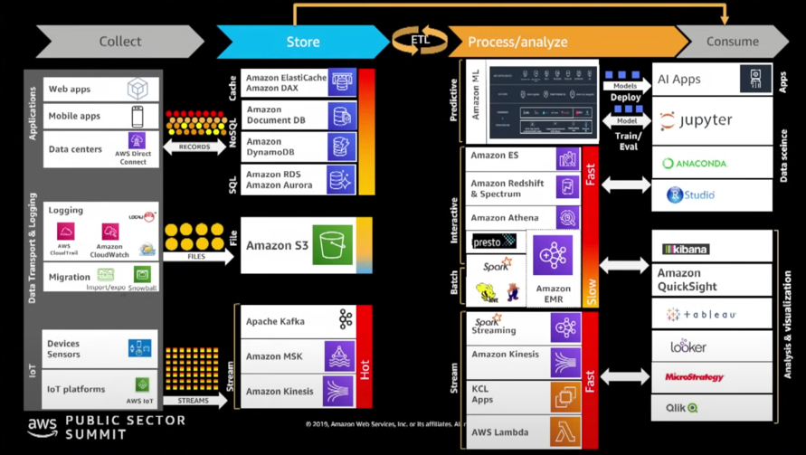
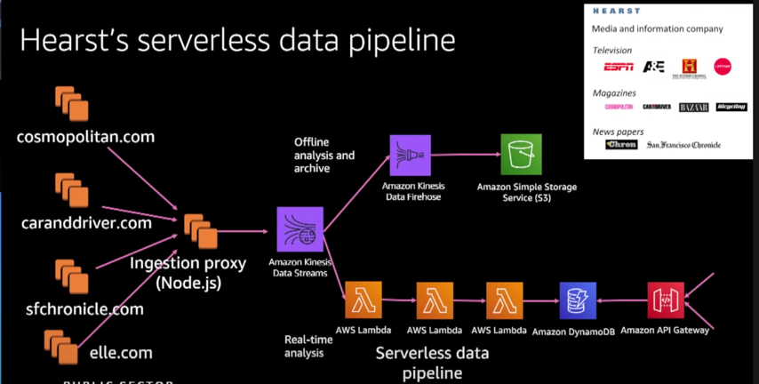
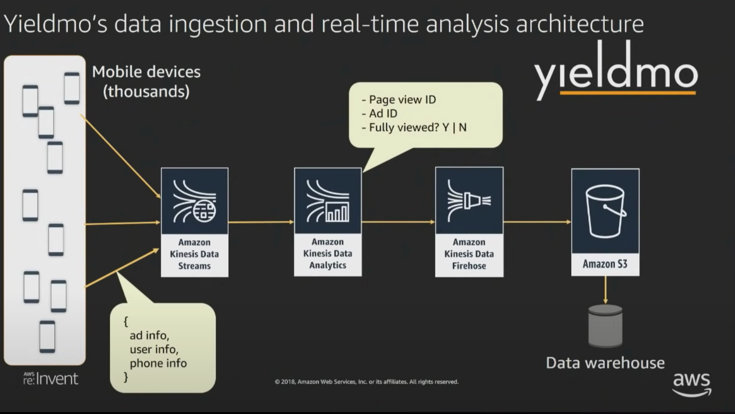
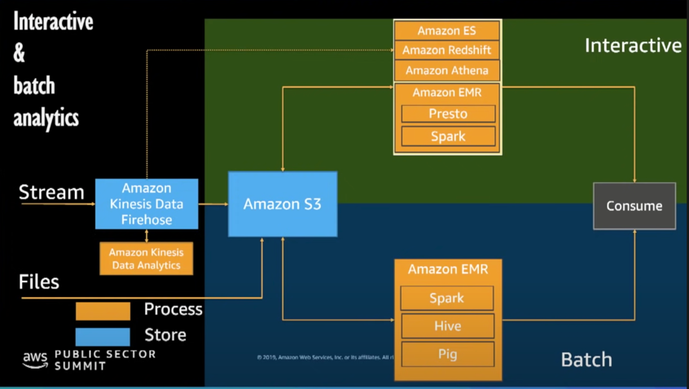
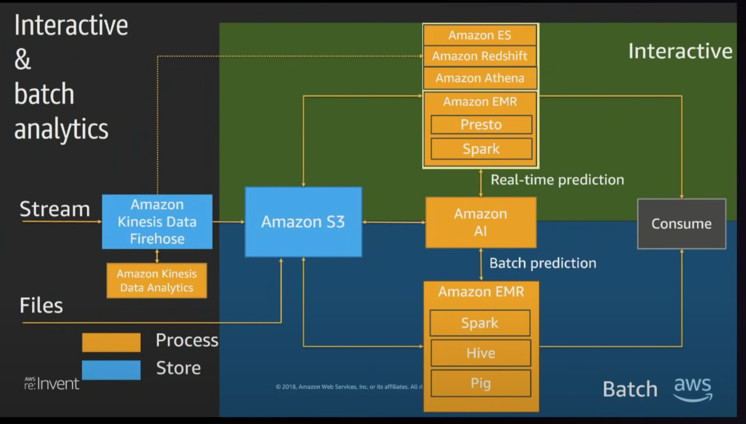
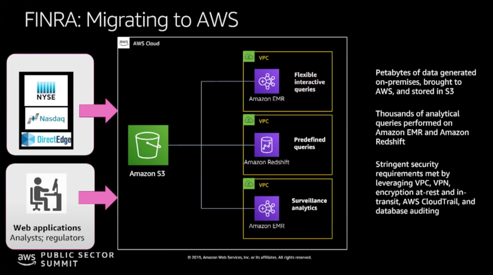
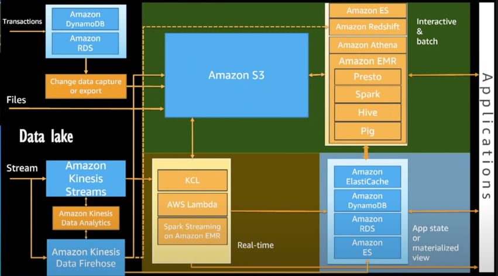

# Design Patterns

When we talk about design patterns, it takes us back to our original question - 'What is the temperature of my Data?'

On LHS we see Hot data, which has the following properties - 
- data that is short-lived.
- Such data loses value as it ages.
- data you want to retrieve faster.

On RHS, we have Cold Data, which has the following properties -
- Data that consists of old records, which are archived.

For Hot Data, you typically ingest using Amazon Kinesis, and perform Streaming Analytics using Spark Streaming/AWS Lambda/KCL Apps.
For Interactive Analytics, you use Amazon Redshift/Athena/Spark-Presto combination.
For Batch analytics, where response time is highest, you can use Hive.

--- old
Moving from left-hand side, we have kinesis, databases, transactional databases and all the way to datalake, cold storages.
if we take a look at Streaming Vs Interactive Vs Batch, what we have is ->
- streaming analytics - done on streaming data source
- batch analytics - done using Hive or aws batch technologies.
- interactive analytics - done using multiple data sources - streaming/batch. Here typical practise w.r.t streaming data based interactive analytics is to use kinsesis stream, pipe it to S3, and use suite of tools available to you to be able to process that data once it hits S3.

## Streaming Analytics

A stream typically arrives to Amazon Kinesis Data Streams, and you usually have Amazon Kinesis Data Analytics to do real-time analytics. Other options could be -
- Amazon Lambda - to read your Stream.
- KCL App
- Micro batching - using spark streaming on Amazon EMR.

Further, as you process the stream, you could do ML by utlizing end-points that are already available as part of Amazon AI ecosystem.

Likewise, you could do Fraud Alerts and send notification to users using Amazon SNS.

You can store data to S3 for doing analytics later on.

If you want to just capture the data to have real-time dashboard or feed a dashboard, then it is a good practise to export like an app state or Materialized View and have another system taht could be a database, like dynamoDb kind of system, and KPI dashboard being setup in front of streaming data.

old
For data that is streaming, very often you would want to do real-time analytics on that data, for which you could use kinesis data analytics.
You could use KCL App, Lambda or EMZR for spark streaming. 
From tehre you would want to do tasks like real time predictive analytics on your data, for which you could use Sagemaker endpoints, which allows you to build these models, and have an end point that these services could cal, and once you call taht end ppint and if that its outside certain threshold, you could actually alert based on certain notification service like Amazon SNS.
you could send that data to S3, and/or create materialze views or app states, and this is an area where you would want to create KPI perforance indicators, and this app state is one of the core architectural components which is used - caching use amazon elastic case or redis or mecache, or maybe dynamo.

Sample example - Hearst's Serverless Data Pipeline

Hearst is a media and information company, and among other things,, they are managing websites for those magazine,es and are using kinesis data treams. As a use case, you can have multiple consumers from the same stream.
So, with kinesis data stream, one stream route is using lanbda for pulling data from teh stream, doing analuytics and push the reuslt of analysis into DynamoDb.
Thsoe tables exposed from an API to drive dashboard.
But otehr route, is kinesis data firehose to capture Streaming events and delivering them into S3 for further analytics later one.

old
Hearst is a media and information company, and they have wide number of different channels - magazine, newspapers, media channels like ESPN, etc under their umbrella.
And so they have various infromation coming from different websites, and going into kinesis data streams.
Once it hits data streams, and since it is a stream so you could have multiple consumers - 
    one of those consumers coud store my data back into a datalake or data reprosutory.
    another consumer could build real-time dashboard or build a real-time analysis of that data.
This is what they are donig.
Their data is flowing to Firehose which is storing data to S3.
Another consumer is going through lambda pipeline, hitting DynamoDb to be able to store that app state or store that analysis state which is exposed through an API Gateway which allows you to have a RESTFul endpoint, defined through swagger to get the current state of data.

Eg 2 - Yieldmo's data ingestion and real-time analytics architecture

They have 1000s of mibile devices whose data is passed through kinesis data streams.
On it, they are running kinesis data analytics.
in Hearst, they used lambda - wherein their developers wrote function codes to be able to process the real-time data in order to store it inot dynamoDb table.
In Yieldmo, customer is writing SQL to be able to run same sort of processing on real-time feeds, and then do aggregation and filtering on taht data, and store it into data warehosueing using Firehose and S3 channel.

## Interactuive & Batch Analytics

Here also we start with teh stream.
The fact taht you might do interatuve and batch analytics doesnt mean you dont have streaming data. So you have streaming data, and you use Kinesis Firehose to caopture them into S3.
But you also might have files that you would want to deliver directly to S3.
From kinesis data firhose, its a deliverys tream - htink of it as a pipe that delivers. So, the supported target, apart from S3, is also redshift for data warehousing or elastic search to do Kibana dahsboarding based analysis.
To do interactive analytics over S3, a great tool is Athena. But also running EMR cluster with Presto and spark for Interactive Analytics
For Batch analytcis, here 2 main tools are - EMR and Glue jobs.
With EMR, 2 main frameworks are Spark and Hive.

In above diagram, Top layer is Interactive Analytics and Bottom layer is Batch analyutics.

old -
In batch and interactive analytics, you still might have streaming data coming in.
For example, if you have ClickStream data, you might want to start analyzing data interactively like What certain users are doing, what different profile of users I have>?
We also might have different data sources coming in S3 through wide variety of methods - Snowball, S3 accelerate transfer, integrating data from different departments in the company, etc.
As soon as Streaming data flows in, it gets pushed into S3, and simultaneously gets loaded into redshift or elasticsearch.
For processing you could use Athena or EMR.
For Batch processing, we earlier used Hive and Pig, and now SPark is being used.

Eg- FINRA : Miograting to AWS

FINRA is the financial regulatry auhoruty in USA, and is using AWS for lot of analyutics.
They are ingesting over 75 billions of records on daily basis.
Data is coming from various sources into S3.
From S3, they have multiple systems doing analytics, abd this is back to where we say, you can have multiple clusters doing analytics, and these clsuters would be specific to workload you want to support.
For example - 
- redshift - pred-defined queries.
- multuople EMR clusters to perform interactive analytcis and Surveillance analytics for detecting fraud.

FINRA has strict security requirements, and are utilizing things like VPC. Redshift and EMR can be hosted into VPC.
They also use encryption at rest and in transit in S3.
they are also using Cloud Trail, which is for audit purposes. Cloud Trail captures every single API call into AWS, and you can have an audit trail for any action that happens on your infrastructure.

old -
FINRA ingests 75 billion events per daya, wherein this includes - Stock information, Financial Trade information, and what they are really looking is find things like Market Manipulators, and other anomalous behaviour on the stock market.
All this data flows into S3.
They have canonical data issue - different brokerage report data in different formats. It goes in the raw form into canonical form and using wide number of EMR & redshift clusters to process data.
This shows the flexibility in your architecture - wherein you are storing data in format which is easily consumable by -
- multiple types or same service like mEMR
- data warehouse
- data lake analytics by your ML.

## Datalake
  

Final pattern in our reference architecture is 'Datalake'.
Here Amazon S3, along with Glue Catalog, together are playing central role.
There are multiple ways ot put data into S3.
if you have relational databases, and you want to have CDC, Database migration servcie is a great way.Other way is with Glue ETL jobs top put data into S3.
For streaming data arriving, Amazon Firehose is a great way - you can use Kinesis data analuytics to do data analytcis and them put them back to Stream, and thenput them bakc to S3.
From Amazon s3, you can use lambdas or spraarl streaming or KCL appliacations to do a realtime analytics, and then load data into some sort of application state or materialized view so taht you drive dashboard or you can have batch or interactive layer above your data lake so that you can explore data in data lake.
Servcie as for batch and interactive analutcs here are - redhsift, athena, EMR, presto.

Old -
When you are building a data lake, its about tying in interactive and batch processing, wherein S3 is centre of lake.
Another important aspect of datalake is metadata management -AWS Glue Catalog, which serves as common metadat store.

