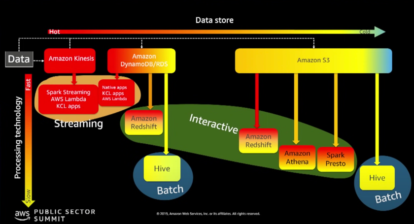
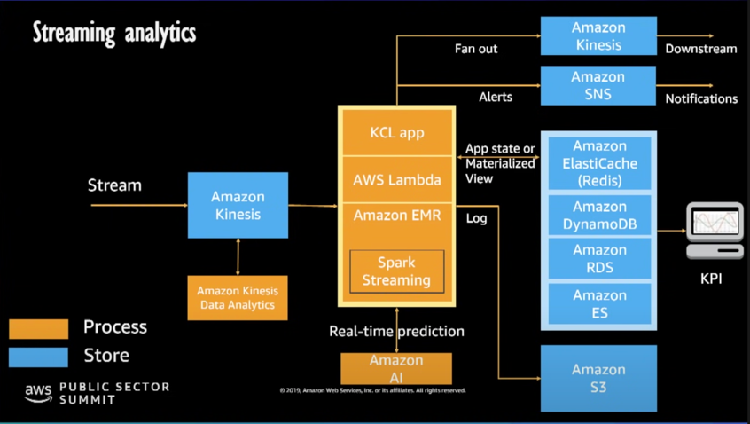
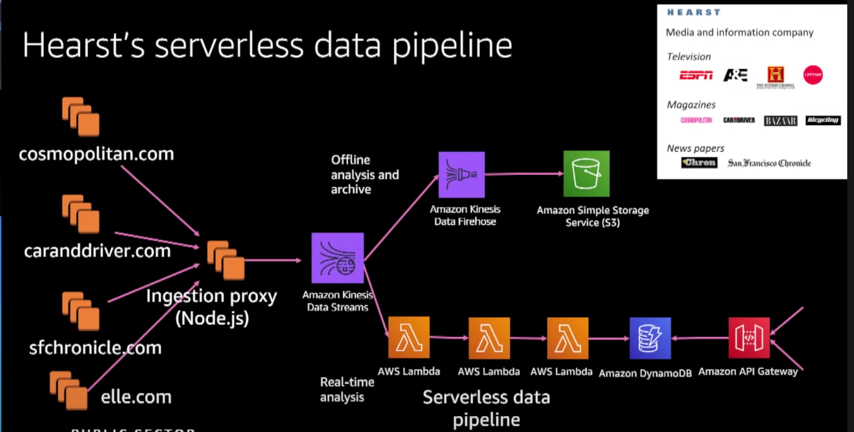
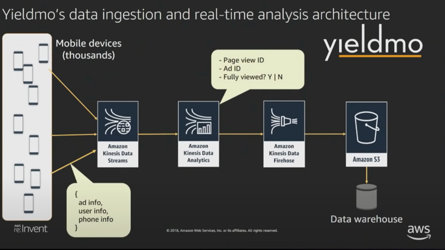
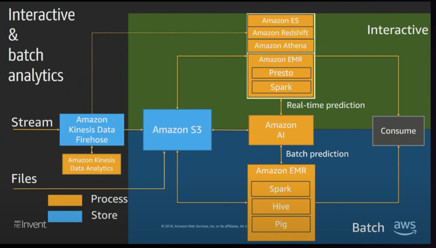
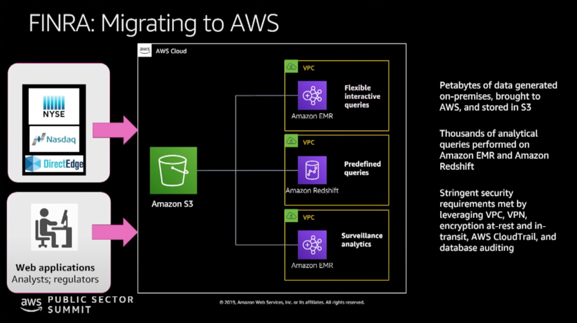
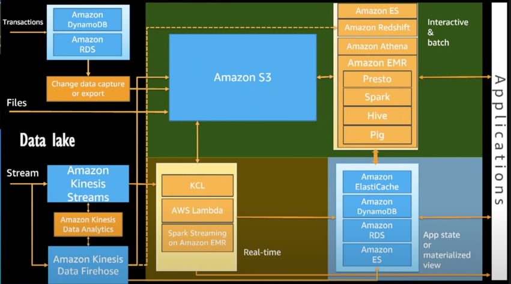

# Design Patterns

## What is the temperature of my Data?

As we talk about design patterns, it takes us back to our original question - **'What is the temperature of my Data?'**  
Moving from left-hand side, we have Kinesis, Databases, Transactional databases and all the way to Data lakes & Cold storages.  

On LHS we see **Hot data**, which has the following properties -   
- data that is short-lived.  
- Such data loses value as it ages.  
- data you want to retrieve faster.  

On RHS, we have **Cold Data**, which has the following properties -  
- Data that consists of old records, which are archived.  

For **Hot Data**, you typically ingest using Amazon Kinesis, and perform Streaming Analytics using Spark Streaming/AWS Lambda/KCL Apps.    
For **Interactive Analytics**, it is done using multiple data sources - streaming/batch. Here typical practise w.r.t streaming data based interactive analytics is to useKinesis stream, pipe it to S3, and use suite of tools available to you to be able to process that data once it hits S3. You use Amazon Redshift/Athena/Spark-Presto combination.   
For **Batch Analytics**, where response time is highest, you can use Hive or AWS Batch technologies.   

## Streaming Analytics

For Streaming data, very often you would want to do **real-time analytics** on that data, for which you could use **Amazon Kinesis Data Analytics**.  
Other options could be -  
- Amazon Lambda - to read your Stream.  
- KCL App  
- Micro batching - using spark streaming on Amazon EMR.  

Further, as you process the stream, you could do **real time predictive analytics** on your data (i.e. ML) by utilizing end-points that are already available as part of Amazon AI ecosystem like **Sagemaker**, which allows you to build these models, and have an end point that these services could call.  
Likewise, you could do Fraud Alerts and send notification to users using **Amazon SNS**.  

You can store data to **S3** for **doing analytics later* on.  

If you want to also capture the data to have **real-time dashboard** or feed a dashboard, then it is a good practise to export like an **App State or Materialized View** and have another system that could be a database, like **DynamoDb** kind of system, and KPI dashboard being setup in front of streaming data.  
App Store is based on **cache**, including Memcache, Redis or Amazon ElasticCache.  
  

### Example - Hearst's Serverless Data Pipeline

  

**Hearst** is a media and information company, and they have wide number of different channels - magazine, newspapers, media channels like ESPN, etc. under their umbrella.  
And so they have various kinds of information coming from different websites, and going into **Amazon Kinesis Data Streams**.  
Once it hits the data streams, and since it is a stream, so you could have **multiple consumers** - 
- one of those consumers coud store my data back into a datalake or data repository.  
- another consumer could build real-time dashboard or build a real-time analysis of that data.  

This is what they are doing.  
Their data is flowing to Firehose which is used to capture Streaming events and delivering them into S3 for further analytics later on.  
Another consumer is going through lambda pipeline, pulling data from the stream, doing analytics and push the results of analysis into DynamoDb. 
- In DynamoDb, we store that app state or store that analysis state which is exposed through an API Gateway, that allows you to have a REST-Ful endpoint, defined through swagger to get the current state of data.  

### Example 2 - Yieldmo's data ingestion and real-time analytics architecture

  

They have 1000s of mobile devices whose data is passed through kinesis data streams.
On it, they are running kinesis data analytics.  
In Hearst, they used lambda - wherein their developers wrote function codes to be able to process the real-time data in order to store it into DynamoDb tables.  
In Yieldmo, customer is writing SQL to be able to run same sort of processing on real-time feeds, and then do aggregation and filtering on that data, and store it into data warehouse using Firehose and S3 channel.  

## Interactive & Batch Analytics
 

In above diagram, Top layer is Interactive Analytics and Bottom layer is Batch analytics.  

Interactive & Batch pipeline will have data with different latencies -  
- Streaming data - The fact that you might do interactive and batch analytics doesn't mean you don't have streaming data. So you have streaming data, and you use Kinesis Firehose to capture them into S3.   For example, if you have ClickStream data, you might want to start analyzing data interactively like What certain users are doing, what different profile of users I have?   As soon as Streaming data flows in, it gets pushed into S3, and simultaneously gets loaded into Redshift for data warehousing or Elastic Search to do Kibana dash-boarding based analysis.   For processing such data over S3, you could use Athena or EMR with Spark/Presto.  
- Batch data - you also might have files that you would want to deliver directly to S3.   This data would be coming from different data sources coming into S3 through wide variety of methods - Snowball, S3 accelerate transfer, integrating data from different departments in the company, etc.   For Batch analytics, here 2 main tools are - EMR and Glue jobs.   For Batch processing in EMR, we earlier used Hive and Pig, and now Spark is being used.  

### Example -  FINRA : Migrating to AWS

FINRA is the financial regulatory authority of USA.  
It ingests 75 billion events per day, which this includes - Stock information, Financial Trade information, and what they are really looking is find things like Market Manipulators, and other anomalous behaviour on the stock market.  

Data is coming from various sources into S3.   
- All this data flows into S3.
- They have **canonical data issue** - different brokerage report data in different formats. It goes in the raw form into canonical form and using wide number of EMR & redshift clusters to process data.

From S3, they have multiple systems doing analytics, and this is back to where we say, you can have multiple clusters doing analytics, and these clusters would be specific to workload you want to support. 
For example -   
- redshift - pre-defined queries.
- multiple EMR clusters to perform interactive analytics and Surveillance analytics for detecting fraud.

This shows the flexibility in your architecture - wherein you are storing data in format which is easily consumable by -
- multiple types or same service like EMR
- data warehouse
- data lake analytics by your ML.
 
FINRA has **strict security requirements**, and are utilizing things like VPC.   
**Redshift and EMR** can be hosted into VPC.  
They also use **encryption** at rest and in transit in S3.  
They are also using **Cloud Trail**, which is for audit purposes. Cloud Trail captures every single API call into AWS, and you can have an audit trail for any action that happens on your infrastructure.  

## Datalake
  

Final pattern in our reference architecture is 'Datalake'.  
Here Amazon S3, along with Glue Catalog, together are playing central role.  
- When you are building a data lake, its about tying in interactive and batch processing, wherein S3 is centre of lake.
- Another important aspect of datalake is metadata management -AWS Glue Catalog, which serves as common metadata store.

There are multiple ways to put data into S3.  
- If you have Relational Databases, and you want to have CDC, Database Migration Service is a great way.    Other way is with Glue ETL jobs top put data into S3.  
- For Streaming Data arriving, Amazon Firehose is a great way - you can use Kinesis data analytics to do data analytics and them put them back to Stream, and then put them back to S3.  
- From Amazon S3, you can use lambda or spark streaming or KCL applications to do a real-time analytics, and then load data into some sort of application state or materialized view so that you drive dashboard or you can have batch or interactive layer above your data lake so that you can explore data in data lake.  

Service as for batch and interactive analytics here are - Redshift, Athena, EMR, Presto.  