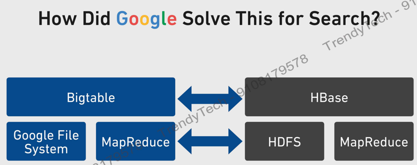

### 4 conditions for a database
1. Structured data – data is stored in rows and columns  
2. Random access – to values  
3. Low latency – in a given set of rows if you want to search one row, it can be done in short span of time. We have features like indexes to facilitate this.  
   Both low latency and random access are co-related – both happen alongside.  
4. ACID properties.  

#### ACID Properties 
**Atomic**  
Eg – A is transferring Rs 5000 to B’s a/c, then 2 operations are happening – debit in A’s a/c and credit in B’s a/c
Atomicity means either both operations happen, or none happen.  

**Consistency**  
It means the **constraints** should be met.  
Eg- we have employee table, and I want each employee to have new ID, here we can place unique key constraint.   
We can place different kinds of constraints to ensure data is consistent as per our requirements.  

**Isolation**  
Isolation means that If 2 persons are operating on a row – both are making a change to row, then these operations shouldn’t happen at random.   
There should be a sequence associated with them through lock mechanism.  
That is concurrent operations on database should appear as though they happen in some sequence.   

**Durability**   
It means that whenever the system fails due crash, power cut etc, it should not be that system comes down.   That is data is safe.  
Things should be up and running after failure.   

    
#### Hadoop makes a very poor database, because ...
1.	Supports unstructured data  
2.	No random access  
-	Data kept in form of files and not rows and columns.   
-	So, random access not possible.  
3.	High latency   
4.	No ACID compliance  

To overcome limitation of random access or quick access of data, google published a paper on **Big Table**, a distributed storage system for structured data.  
To recall, google gave 2 main papers, initially  –  
•	GFS or google file system – for storage  
•	MapReduce – for processing  

Now, it gave another paper for quick searching – BigTable.  

Hbase is a distributed database management system, that runs on top of Hadoop.  
So, if you have 4 node Hadoop cluster, Hbase runs on this Hadoop cluster.  

 

#### Hbase properties
•	Distributed – stores data in HDFS  
•	Scalable – capacity directly proportional to number of nodes in the cluster.  
•	Fault tolerant – piggybacks on Hadoop. HDFS gives replication of data, and so same for HBase.  

