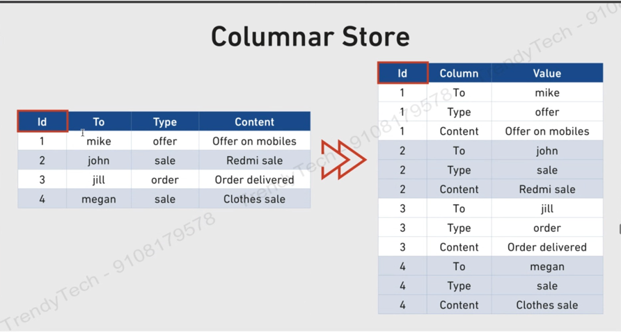
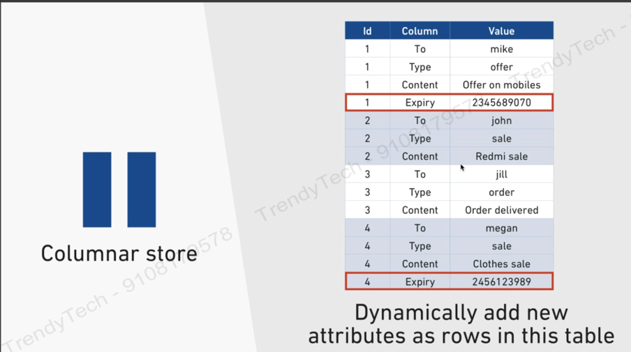
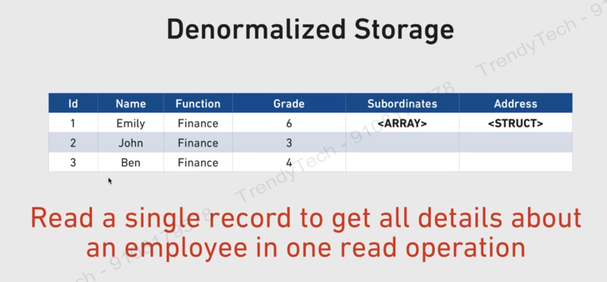
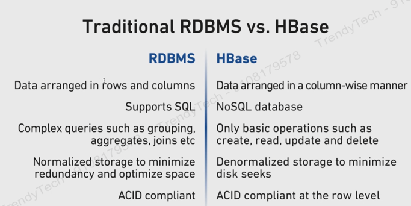

Hadoop is not a database.  
BigTable paper led to Hbase, which is a distributed database management system running on top of Hadoop.  

To recall 4 requirements of database are –  
1.	Structured data  
2.	Low latency  
3.	Random reads  
4.	ACID compliance  

Let us see how Hbase fares against these requirements of database.  
1.	Structured – loose data structure.  
-	HBase is not as rigid as traditional databases like MySQL. For example, all rows will have equal number of columns.
2.	Low latency – real time access using row-based indices called row keys.  
3.	Random access – row keys allow access updates to one record.  
4.	Somewhat ACID compliant – some transactions will have ACID properties.  

Hbase can offer 2 things –  
1. Quick searching – based on row-keys.  
2. Processing – mapreduce.  
   Not the main use case as we already have Hive for this.

### Hbase Vs Relational Databases
Properties of Hbase –  
1.	Columnar store   
2.	Denormalized storage  
3.	Only CRUD operations  
4.	ACID at row level.  

#### Columnar storage
Traditional databases provide row-based architecture, while Hbase provides column based  

   

1 row is divided into many rows depending on number of columns.  
Advantage of columnar of stores –  
a.	Sparse tables – if your table is sparse, no waste when storing sparse data.  
b.	Dynamic attributes – update attributes dynamically without changing storage structure.   

Sparse Tables -   
In traditional databases, columns which have no values, they still occupy space even if no data is present in them. Thus, there is wastage of space.  
In Hbase, we handle sparse tables.  

Dynamic attributes –  
Unlike Hbase, in traditional databases changing column types/adding new columns/dropping them – all of this is a painful task.  
In columnar store of Hbase, each row can have a different number of columns. For example, in below image, we have ‘expiry’ column for id 1 and 4 only.  

   

Further no extra space – sparse table handled.  
Dynamically adding columns. We can have different columns with different rows.  

#### Denormalized Storage
In traditional database, data is normalized.  
That is data is divided into multiple small tables.  
In Hbase, we don’t prefer normalization.   
That means we store data into 1 big table.  
Advantage. – read a single record to get all details about a person in a single read operation.   

   

#### CRUD operations in Hbase 
In normal database, we have join operations.  
In Hbase, we can only perform CRUD operations.  
Join/groupBy/orderBy – not supported in Hbase.  
CRUD – create, read, update & delete.  
Note – since data is denormalized, so no need of Joins.   
This is why Hbase tables should be self-contained – i.e., contain all required info in 1 row.  

#### ACID Compliance at row level
Traditional databases are ACID compliant.  
Hbase provides ACID compliance at row level.  
That means,   
•	Whenever we are trying to update multiple columns for a single row, then either all of them will be updated or none will be updated.  
•	When we talk about updates for multiple rows in Hbase then there is no guarantee. There could be a possibility that few rows got updated and rest not updated.  
•	It also means, even if we are updating single column in multiple rows, there is no guarantee.  

 