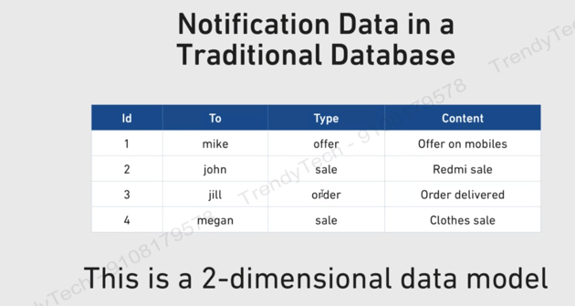
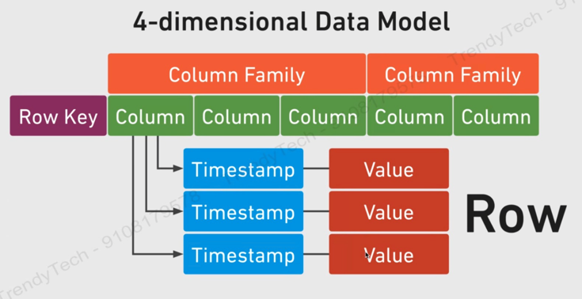
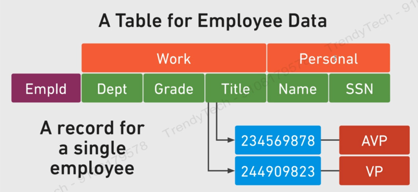
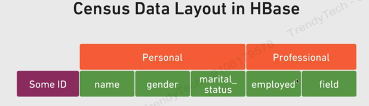

#### How is data laid out in Hbase?
In traditional database, data is stored in rows and columns in a 2D data model, as shown below -  
  

So, in traditional database we have a 2-dimensional data model, wherein each value can be associated with a ‘Id’ and column.  
Eg – ‘jill’ can be associated as id=3 and column=’To’  

In Hbase, we have 4-dimensional data model,   
•	Row Key  
•	Column  
•	Column Family  
•	Timestamp  
 
Consider an example of Employee data, wherein it has below columns –  
•	empId  
•	dept  
•	grade  
•	title  
•	name  
•	SSN  
 

In above, we have 4 dimensions as shown below -  
•	empId as row key – as it uniquely identifies a record.  
•	Dept, grade, title, name and SSN – columns.  
•	Dept, grade and title represent one column family (work), and Name & SSN as other column family (Personal)  
o	Column family represents logical grouping of data.  
•	Timestamp   
o	It is represented as epoch time. Eg – for a title, a person is AVP at one epoch time, and is VP at another timestamp.  
o	Whole purpose of timestamp is to maintain versions.   
	By default it will give you latest version.  

#### Row Key
-	Uniquely identifies a row  
-	Represented internally as a byte array  
o	All data in Hbase is internally represented as Byte array.  
o	There is no concept of INT, String, etc.  
-	Can be primitives, structures, arrays  
-	Sorted in ascending order.  
o	Reason to keep keys in sorted manner is that it can use Binary Search technique to quickly retrieve data in O(longN) time.  

#### Column Family
All rows have the same set of columns families  
Each column family is stored in a separate data file  
Set up at schema definition time.  
Can have different columns for each row.  
•	For example, if we have 10000 rows and we have 10000 rows, and we have 2 column families, then each of the 10000 rows are bound to have these 2 column families. But number of columns under the column family may vary from row to row.  
•	For example, we have 6000 rows with 10 columns and 4000 rows with 15 columns.  

#### Columns
Columns are units within a column family.  
New columns can be added in the fly.  
Syntax : ColumnFamily: ColumnName   
eg- Work:Department.  

#### Timestamp
Used as the version number for the values stored in a column.  
The value for any version can be accessed.  

Likewise, we have another example-  
 
