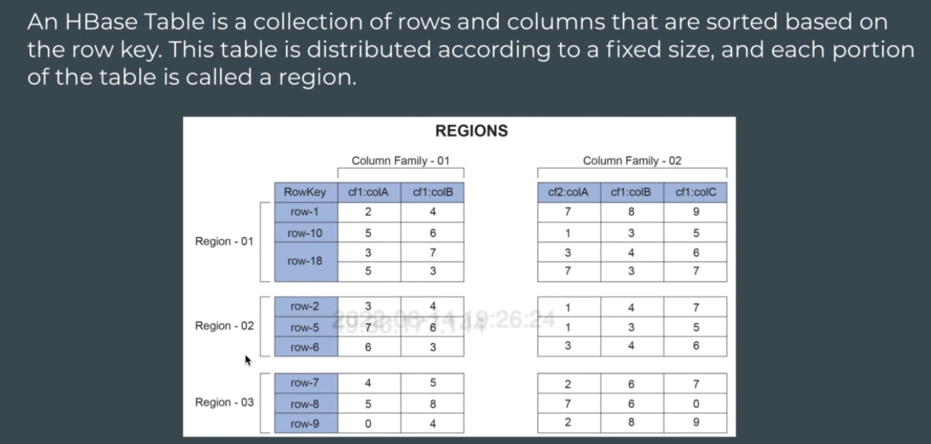

## HBase Architecture Part-1

Hbase table is divided into column families. Eg – employee table has 2 column families –  
•	Personal – name, age, address  
•	Professional – designation, department, salary  

Consider we have row keys based on employee id, say from 1 to 10000.  
Data is divided among regions based on row-key.  
So, these employee IDs will be divided among regions –  
•	Region 1: emp id    1 – 2500  
•	Region 2: emp id 2500 – 5000  
•	Region 3: emp id 5000 – 7500  
•	Region 4: emp id 7500 – 10000  

Number of regions decided by admin.  

These regions are held by region server.  
A region server can hold many regions.  
Eg – say –  
•	Region-server 1 holds region1 and region2  
•	Region-server 2 holds region3 and region4  

Importance of dividing among regions is that go specific region quickly based on row-key to be searched using binary search technique.  

Ideally when you link to data nodes, region servers have 1-2-1 mapping.  
So, if 4 data nodes, then we can have 4 region servers, one running on each data node.  

One data node can hold more than 1 region-servers also, but that is not a good practice.  

Each region server holds multiple regions.  
Each region holds data sorted based on row keys.  
Remember data for each column families are stored in separate files.  

 

#### MemStore and HFile
As Name suggests, it is something that represents in-memory.  
Suppose you are inserting one record, then you wouldn’t want a new file being created each time you insert a new record. This is coz, say for 10000 inserts we would have 10000 new files, leading to small file problem.  
Solution – memstore.  
Every insert is appended in memory inside the memstore, and when size of memstore grows to a threshold size, content of memstore will be flushed to disk, and new file will be created. This file which is created from Memstore flush is called HFile.   

HFile – stored on HDFS.  

For each region, there is a memstore per column family.   
So if 4 regions and 2 column families, then number of memstores = 4 x 2 = 8  

In each region, there is a memstore per column family. A memstore is an in-memory write buffer. It stores new or updated data that has not yet been written to HDFS.  
This data gets flushed to HDFS in a new HFile consisting of sorted key-value pairs at regular intervals or based on MemStore size.  
These HFiles are written to the Data nodes of HDFS.  

Hbase architecture is also based on master-Slave Architecture, where HMaster is the master and region servers act as slaves.  

#### WAL or HLog
WAL stands for Write-Ahead-Log.  
It is fault tolerance ability of memstore.  
Data in memstore, before flushing out to disk, it keeps getting appended to WAL, which is stored on disk (HDFS). In case system crashes before memstore could flush its data, one can restore output from WAL by replaying its logs.  

#### Block Cache
Whenever we read the data, the data is cached in memory. For the next reads, it might get data directly from the cache. And this will save lot of time.  
Whole purpose of cache is quick retrieval of info. (similar to cache in spark).  

Note ->  
-	memstore -> 1 per region per column family.   
-	WAL & Block cache -> 1 per region server.  

#### Zookeeper
It is a coordinating service for various distributed systems.  
When you have multiple distributed systems, you need a coordination mechanism. For this we have Zookeeper.  
Every server will send their heartbeat to Zookeeper. This means, zookeeper will know if something has failed when it stops receiving the heartbeat from that server.  
Also, zookeeper will hold the location of MetaTable.  

#### MetaTable
Is a table that holds mapping of regions and region servers.  
That is which row-key is there in which region, and which region server is holding it.  
MetaTable is placed in one of the region servers, and Zookeeper keeps track of location of MetaTable.  

#### HMaster
Hbase has a master-slave architecture.  
HMaster = master and Region Servers = Slaves.  
Master helps to organize things  
Eg –  
HMaster assigns regions to region server.  
In case of some failures or increase in load, HMaster will try to balance the load by assigning some of the regions in loaded region server to other regions. ~ Load Balancing.  

