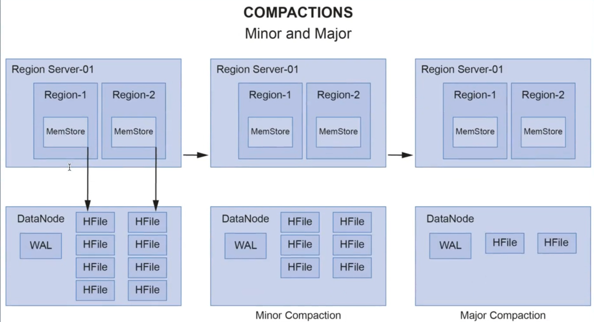

To recall -> 
An Hbase table is divided into regions, and in each Region, data is sorted based on row-key.  
These Regions are stored in Region Servers, and a Region Server can handle many regions.  

In each region, there is a memstore per column family.   
A memstore is an in-memory write buffer. It stores new or updated data that has not yet been written to HDFS.  
This data gets flushed to HDFS in a new HFile consisting of sorted key-value pairs at regular intervals or based on MemStore size.  
These HFiles are written to the Data nodes of HDFS.  

Hbase architecture is also based on master-Slave Architecture, where HMaster is the master and region servers act as slaves.  
 

In above, we have various components of Hbase Architecture.  
We have ->  
- 1 Zookeeper  
- 1 HMaster  
- 2 Region Servers.  
- Each region server has->  
  - 1 WAL/HLog  
  - 1 Block Cache  
  - 2 Regions.  
- Each Region has   
  - MemStore, and associated HFiles.  

#### Region Server
A region server manages regions. There are multiple regions in a cluster.  

Each region server contains the following ->  
- **WAL** – Write-Ahead-Log, also known as **HLog**.   
  - WAL stores New or Updated data that has not been written to permanent storage (as HFiles in HDFS) and can be used for recovery in case of region server failure.  
  - The region server stores the WAL File in HDFS.  
  - So, new data goes to WAL, and from there to MemStore, and on flushing MemStore, it gets persisted to permanent disk – HFile.  
- Block Cache – which is a read cache, stores frequently read data from HDFS.  
- Region –
    - which is assigned a region of the table.   
    - Each region contains a MemStore per Column Family.  

A Client interacts directly with the region server to perform read/write operations.  

#### HMaster
It acts as the Master server and manages multiple Region Servers.  

An Hbase cluster may have 1 or more Master nodes, but only 1 HMaster is active a given time.  
This active node is responsible for –  
- Performing the admin functionalities: HMaster performs DDL operations such as Creating or Deleting Table. That is where structure of table is involved, HMaster is involved.  
- Coordinating with the region servers: HMaster assigns regions to various region servers on start-up and reassigns in case of load balancing or recovery.  
- Load Balancing: whenever there is High load on any region server, HMaster unloads the busy server and reassigns this load to less occupied servers.  
- Recovery: HMaster also handles region server failures by re-assigning the regions or load of the failed region server to another non-failing region server.  

#### Zookeeper 
- It is a distributed open-source coordinating service for distributed applications.  
- Hbase uses Zookeeper to maintain the live server state in the cluster by receiving heartbeat messages from all HMasters (active/ inactive) and Region Servers. So in case it doesn’t receive heartbeat from -> 
  - HMaster – it assumes that is dead, and assigns this role to another passive HMaster.
  - Region Server – it assumes this is dead, and informs HMaster, which in turn takes steps to reassign its load to some other region server.
- It stores the location of META Table.

 

#### DataNode (HDFS)
Hbase stores 2 types of files in DataNode of HDFS ->  
1. WAL
a.	There is 1 WAL file per Region Server that stores the MemStore Data.  
b.	WAL is replayed by region servers in case of a region server crash.  
  
2. HFiles  
a.	It stores the Hbase table data as sorted key-value pairs.  
b.	HFiles are immutable, which means once written, they can’t be modified.  
c.	HFiles are large in size and depend upon the MemStore flush size before compaction.  
d.	HFiles further store data as sets of blocks. This helps in only reading the block, which contains data of interest and not the complete HFile.  
e.	The default block size is 64KB.  
f.	The Data Block Index is an HFile is used to locate the data lock of interest. It contains the key range stored in each data block  
g.	To illustrate ->  
Consider the HFile has size of 250Mb, and Block Size is 64 KB.   
Then in case if you figure out which HFile holds the data, then entire file need not be scanned.   
Rather, based on Block indexes, we get to know which block holds the data, and then that particular block is scanned to get the results.   
So, we are not scanning 250 MB, but rather 64Kb. In truth, it is less than 64Kb as data in blocks are stored in sorted manner, and a binary search algo is applied within a block to search for the data.  

#### META Table
 

A Meta Table is a data structure that stores the location of regions along with the region servers.  
It helps the user identify the region server and its corresponding regions where specific range of key-value pairs is stored.  
The Meta Table is stored in one of the region servers, and its location is stored in the Zookeeper.  

#### Hbase Read/Write Operations
The common Steps involved in Hbase read/write operations are as follows ->  

Step 1: The client contacts the Zookeeper to fetch the location of the Meta Table ( if the client doesn’t have the latest version of Meta Table already cached).  

Step 2: the Client queries the Meta Table to find the location of the region server, which has the region containing the row-key that the client is looking for.  

Step 3: The client caches the identified region server's information as well as the Meta Table location, for future interactions.   

Step 4: The client can now communicate with the specific region’s server, identified in the Step 2 above. This regions server assigns the request to the specific region, where the read/write operations can be executed.  

 

##### Hbase Write operations
 
Step 1: The data first needs to be written to WAL, which is a Write ahead Log. Why – coz data shouldn’t be first written to MemStore which has risk of data loss in case of region server crash.  
WAL stores the new or updated data that has not been written to HDFS and can be used for recovery in case of a region server failure.  

Step 2: Once data is written to WAL, it is placed in MemStore of a region.  
When MemStore becomes full, its contents are flushed to HDFS (Data Node), to form a new HFile.  

Step 3: Finally, an acknowledgment is sent back to the client.  

##### Hbase Read operations
 

Whenever we are reading, we want to read in a way that it takes minimum time as possible.  

Step 1: The region server first checks the Block Cache of the region server that stores the recently accessed data.  

Step 2: in case the data is not available in the Block Cache, it checks for the required data in the in-memory store, i.e., MemStore.  

Step 3: If the MemStore doesn’t contain that particular key-value, then HFile containing that particular key-value pair is identified.  

Once the HFile is identified, instead of reading the entire HFile (~ GB Size), the Data Block index of HFile is scanned to get the Data Block with key-value pair, a Binary search in this data block finally returns the key-value pair (or null in case it doesn’t exists).  

#### Compactions
Flushes from MemStore to HDFS create multiple HFiles, especially during periods of heavy incoming writes, which leads to 2 major problems ->  
1.	The read efficiency gets low. This is because a large number of HFiles increase the number of disk-seeks needed for a read process, thereby adversely impacting the read performance.  
2.	It leads to dirty data. A large number of HFiles might result in a lot of redundancy and inconsistency in data.  

Compaction comes to our rescue against these challenges.  
It refers to the process of combining small HFiles to large HFiles, containing merged, sorted, and most recent information.  
Compactions are of 2 types -  
- Minor -> Here Hbase picks only some of the smaller HFiles and rewrites them into a few larger HFiles.  
- Major – here all HFiles of a store are picked and rewritten into a single large HFile. (It is 1 HFile per MemStore. Eg – below image – in end, we have 2 HFiles – 1 per MemStore).  

Major compaction is more resource intensive than minor compaction, and therefore, admins generally prefer minor compaction to major ones.  
  
 

#### Hbase Data Deletion & Tombstone Markers
Remember ->  
- HDFS is a write-only system. So, data is only written and cannot be updated.   
- Que – how does Hbase support update operations?  
- Ans – through Timestamp. It maintains version of information for a column in a row, and when retrieving you see latest value even though older values are still present and can be accessed.  
  
Delete is a special type of update in Hbase, where the values for which the delete request is submitted are not deleted immediately.  
Rather, these values are masked by assigning a Tombstone Marker to them. So, a new record is inserted in Delete operation, and that masks previous values.     
Every request to read these values (with tombstone markers) returns null to the client, which give client the impression that values are already deleted.  
The reason why Hbase does this is because HFiles are immutable.   
Recall that HDFS doesn’t allow modifying the data of a file. All the values with Tombstone markers are permanently removed during the next Major Compaction.  

#### In the case of Server Failure
1. If the active HMaster fails, the Zookeeper gives the master’s responsibility to one of the inactive HMaster’s in the cluster.  

2. If a region server fails, Zookeeper notifies the HMaster about it.  
HMaster reassigns the regions of the failed region server to some other region server.  
