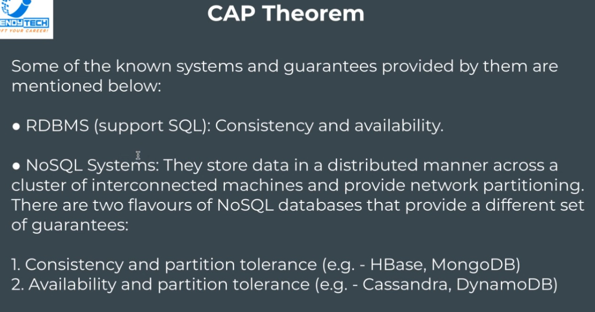
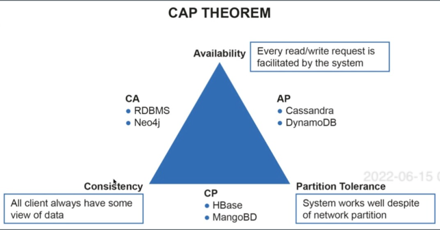
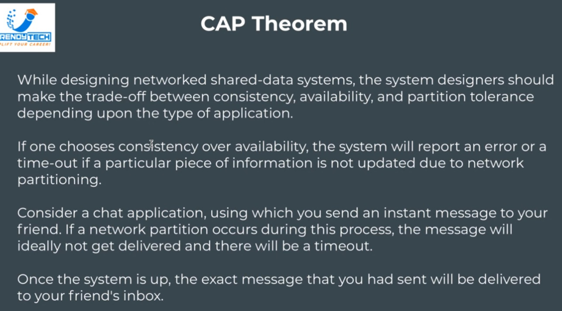
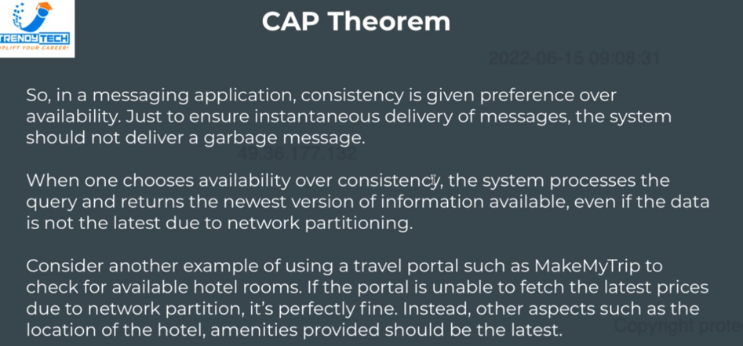
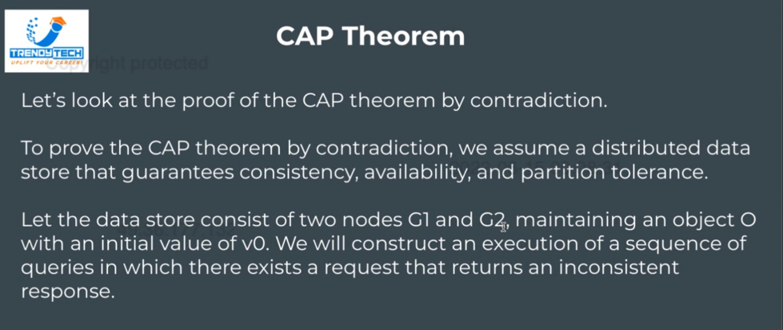
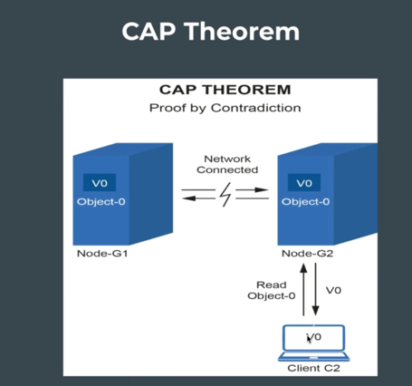
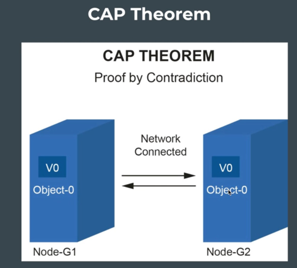
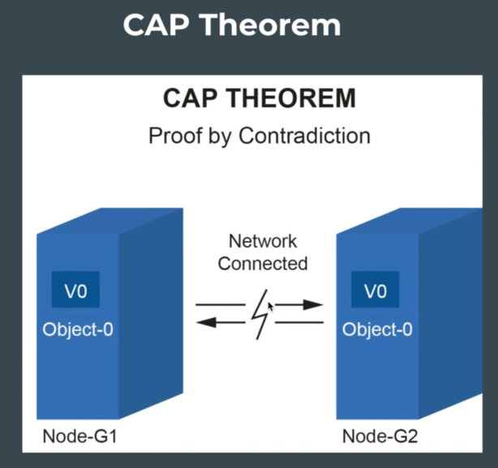

#### CAP Theorem
Very important w.r.t. distributed databases.  
•	C – consistency  
•	A – availability  
•	P – partition tolerance  

CAP theorem says that out of these 3, we can only get 2.  
There is no way we can design a system with all 3 features as guarantee.  
We have to decide our system based on our requirements – which feature we are Ok not having.  

Based on above, we have 3 kinds of systems –  
•	CA system – consistency and availability  
•	AP System – availability and partition tolerance  
•	CP system – consistency and partition tolerance  

#### Consistency
- It means each node will hold the latest value.  
- Whenever we seek result, we shall get latest value not older one.  
- Eg – sending message to someone on WhatsApp; if that person is not connected to internet, that person shall not get any garbage info depicting that message until the time he connects back to internet. Instead, we shall give him correct data.  
  We have to exactly give data which is latest. Eg - chat application. We don’t want to give stale info or garbage info to message sender. Rather there will be a timeout and status get updated as soon as receiver receives message.  
- Similarly, in banking, consistency is priority. If bank doesn’t know latest balance it will deny transaction. It is ok to deny transaction if it is doubtful – but cannot allow transactions.   
  So, in banking we need consistency.  
- Consistency means ->  
    - Latest value is shown, and it is a guarantee that value shown is latest  

#### Availability
- System should always give a response no matter what.   
- Even if it is not sure that value is latest, it will return something. The system won’t timeout, the system won’t error out.  
- To make sure system always gives response or do not error out, we need to compromise on one thing – that we cannot have consistency. Sometimes we give old data.  

#### Partition tolerance
- It states that a system will continue to operate even when there is network or partition failure. Even if system gets disconnected, it will continue to operate.  

#### CAP Theorem w.r.t Distributed Systems
- CAP theorem applies to distributed systems that store data.  
- CAP theorem states that it is impossible for a distributed data store to simultaneously provide more than 2 out of 3 guarantees, namely consistency, availability, and partition tolerance.  
- Consistency guarantees that every node in the distributed system returns the same most successful and recent write  
- Availability is when every requires receives a response without the guarantee that it contains the most recent write  
- Partition tolerance is when the system continues to function and upholds guarantees in spite of network failures.  

 

CA – provided by RDBMS systems  
We won’t discuss CA further  

We focus on AP and CP.  
Why – when we talk about distributed systems, we need to ensure partition tolerance is there.  
So, the tradeoff is always between availability and consistency. We have to choose one or the other.  

NoSQL systems store data in a distributed manner across a cluster of interconnected machines and provide network partitioning.  
There are 2 flavors of NoSQL databases that provide different set of guarantees –  
- CP – HBase and MongoDB  
- AP – Cassandra and DynamoDB  

 
 
 

CP – Eg - chat application. We don’t want to give stale info or garbage info to message sender. Rather there will be a timeout and status get updated as soon as receiver receives message.  
Likewise in banking application, we need CP -> GooglePay and Paytm gives error as consistency is important.  

AP – MMT travel portal.   

Cases where we chose Consistency over Availability.  
We want latest results. If results are not latest give error or timeout.  
Eg – chat application, UPI, banking etc.  

Cases where we prefer availability over consistency.  
We want immediate results even if it is not the latest.  
Eg – MMT booking hotel on it –   It shows a price, but system isn’t able to confirm if rates are latest or not. It tries to go with earlier result. Here we don’t want to error or timeout to customer as it will degrade user experience.   

#### Proving CAP Theorem by Contradiction Approach
 
 
 
 
 

Let us try to provide cap theorem by contradiction.    
Consider a case wherein we have 2 node cluster and each maintaining an initial value for object O with initial value v0.    
Now, both nodes have a copy of vO with them    
Then if network failure happens, then client request comes in such that it updates value of Object v0 to v1 on G1.    
Now, another client comes in, and connects to G2 machine and pulls value of object O, and it gets vO and not v1 which is latest. If you want to be consistent, the system should wait until network gets restored. So, there will be a timeout if you want to be consistent.    
This contradicts our all 3 guarantees.    
CAP theorem proved.    
Note network partition means network failure.    
