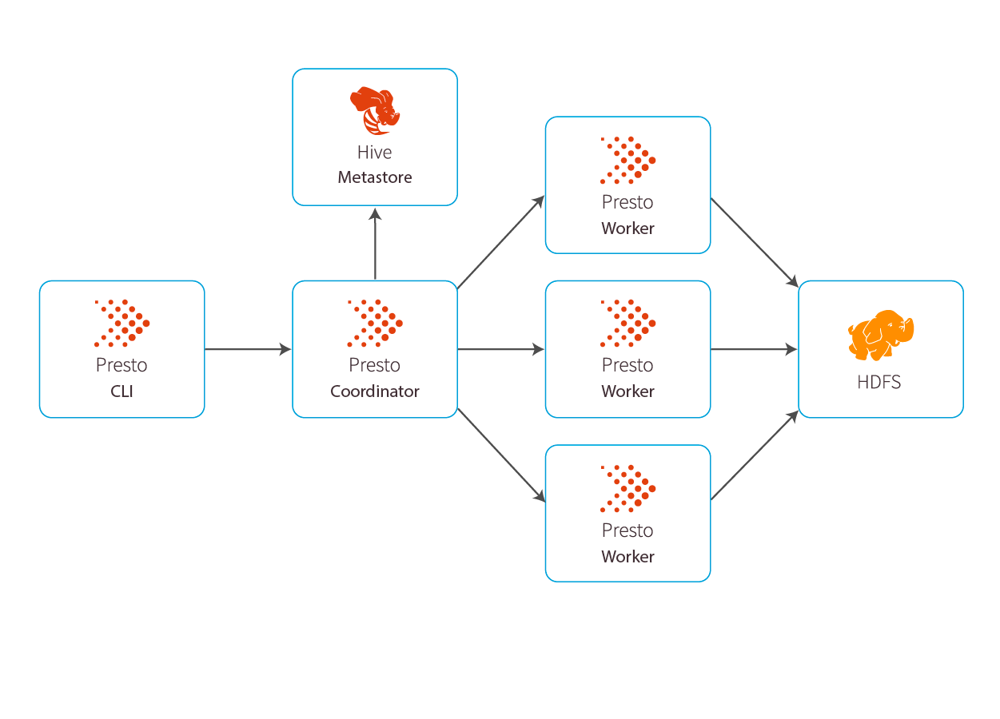

#### What is the Presto?
Presto is an _open source_ _distributed_ system that can run on multiple machines.   
Its **distributed SQL query engine** was built for fast analytic queries.  

Presto was initially designed at Facebook as they needed to run interactive queries against large data warehouses in Hadoop.   
It was explicitly designed to fill the gap/need to be able to run fast queries against data warehouses storing petabytes of data.   

Presto is a SQL based querying engine that uses an **_MPP architecture_** to scale out.   
Because it is a querying engine only, it separates compute and storage relying on connectors to integrate with other data sources to query against.   
In this capacity, it excels against other technologies in the space providing the ability to query against:  
- Traditional Databases  
- Non-relational Databases  
- Columnar file formats like ORC, Parquet and Avro – stored on - HDFS, AWS S3 etc.    

#### Presto Architecture
At a high level, the Presto architecture looks something like this:  

  

A typical Presto deployment will include one Presto Coordinator and any number of Presto Workers.  
- Presto Coordinator: Used to submit queries and manages parsing, planning, and scheduling query execution across Presto Workers.   
Coordinators connect with workers and clients via REST.  
- Presto Worker: Processes the queries, adding more workers gives you faster query processing.  

When it comes to managing the data itself, Presto has several important components that enable this.  
- Catalog: Presto Catalogs contain the information about where data is located – they contain schemas and the data source.   
When users run a SQL statement in Presto, it means they’re running it against one or more catalogs.   
Eg - Hive catalog, Postgres catalog etc.  
- Tables and schemas: If you’re familiar with relational databases, it’s the same concept.   
- Connector: Connectors are used to integrate Presto with external data sources like object stores, relational databases, or Hive.  

Last, when it comes to running Presto queries there are some specific components to know.  
- Statements and Queries - Presto executes SQL statements. It parses SQL statement, creates a query along with a distributed query plan that is then distributed across a series of Presto workers.   
A statement is simply passing along the instructions while the query is actually executing it.  

- Stage: To execute a query, Presto breaks it up into stages. There may be several stages that implement different sections of the query.   
Every query has a “roots” stage which aggregates all the data from other stages.   
Keep in mind the stages themselves don’t run on Presto workers, they may run on the database underneath (this is called push-down).  

- Task: Stages (from above) are implemented as a series of tasks that may be distributed over a network of Presto workers.   
Tasks have inputs and outputs and are executed in parallel with a series of drivers.  

- Split: Splits are sections of larger data sets and how tasks operate. When Presto schedules a query, the Coordinator keeps track of which machines are running tasks and what splits are being processed by tasks.  

- Drivers and Operators: Tasks contain one or more parallel drivers and they are operators in memory. An operator consumes, transforms and produces data.  

- Exchange: Exchanges transfer data between Presto nodes for different stages of a query.   
Tasks produce data into an output buffer and consume data from other tasks using an exchange client.  

#### Deployments, Configurations & Installations
In practice, you might deploy Presto in the cloud or on-prem. Presto sits between your BI tool and your storage.  

**Alluxio** provides a multi-tiered layer for Presto caching, enabling consistent high performance with jobs that run up to 10x faster, makes the important data local to Presto, so there are no copies to manage (and lower costs), and connects to a variety of storage systems and clouds so Presto can query data stored anywhere.

#### Presto Vs Hive
| Presto                                                                                                                                                                                             | Hive                                                                                                                                                      |
|----------------------------------------------------------------------------------------------------------------------------------------------------------------------------------------------------|-----------------------------------------------------------------------------------------------------------------------------------------------------------|
| ANSI SQL                                                                                                                                                                                           | HiveQL                                                                                                                                                    |
| not available in Presto                                                                                                                                                                            | Users can plugin custom code in Hive                                                                                                                      |
| Presto can handle limited amounts of data                                                                                                                                                          | Can handle larger volume of data                                                                                                                          |
| low failure tolerance                                                                                                                                                                              | can tolerate failures                                                                                                                                     |
| Presto uses MPP architecture to query HDFS without map-reduce   MPP Querying engine that executes queries in memory, pipelined across the network between stages, thus avoiding unnecessary I/O | uses map-reduce architecture and writes data to disk   MPP Querying engine that does Batch processing using Apache Tez or MapReduce compute frameworks |

Note ->
- Spark : general purpose processing engine.  
- Hive   : MPP Querying engine. Does Batch processing using Apache Tez or MapReduce compute frameworks.  
- Presto : MPP Querying engine. Executes queries in memory, pipelined across the network between stages, thus avoiding unnecessary I/O.        

[Credits 1](https://www.alluxio.io/learn/presto/architecture/)  
[Credits 2](https://www.alluxio.io/learn/presto/)
