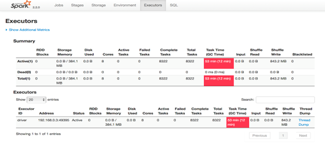

### Introduction
Spark runs on the Java Virtual Machine (JVM).   
Because Spark can store large amounts of data in memory, it has a major reliance on Java’s memory management and garbage collection (GC).   
Therefore, garbage collection (GC) can be a major issue that can affect many Spark applications.

### Common symptoms of excessive GC in Spark are:
- Application speed.  
- Executor heartbeat timeout.  
- GC overhead limit exceeded error.  

Spark executors are spending a significant amount of CPU cycles performing garbage collection. This can be determined by looking at the “Executors” tab in the Spark application UI. Spark will mark an executor in red if the executor has spent more than 10% of the time in garbage collection than the task time.  

  

### Key points
  
1. GC is about recovering space - when you add more objects, you need to evict old ones - for this GC is done.  
  
2. why GC is a concern-> if high GC, it means more time is spent in GC collection than in actual execution.  
  

### How to handle GC ?
1. Data Structure - If using RDD-based applications, use data structures with fewer objects. For example, use an array instead of a list.  

2. Specialized Data Structures  
If you are dealing with primitive data types, consider using specialized data structures like Koloboke or fastutil. These structures optimize memory usage for primitive types.  

3. Storing Data Off-Heap  

4. avoid UDF  

5. Less objects, if possible?  
Cost of garbage collection is proportional to the number of Java objects. So if more objects, more GC.  
when you have large number of RDDs in your job, GC becomes a point of worry.  
It is usually not a problem in programs that just read an RDD once and then run many operations on it.  
  
6. Kryo serialization -  
if object is large, prefer caching in serialized form - as serialized object require less storage.  
Use Kryo serialization if you want to cache data in serialized form, as it leads to much smaller sizes than Java serialization.  
  
7. Measuring the Impact of GC ->  
By  adding **-verbose:gc -XX:+PrintGCDetails -XX:+PrintGCTimeStamps**   
This will collect statistics on how frequently garbage collection occurs and the amount of time spent GC.  
  
8. Advanced GC Tuning  

Java Heap space is divided into 2 regions Young and Old.  
* Young generation is meant to hold short-lived objects - it is sub-divided into 3 regions - Eden. Survivor1, Survivor2.  
* Old generation is intended for objects with longer lifetimes  
 
A simplified description of the GC Procedure:   
  - When Eden is full, a MINOR GC is run on Eden and objects that are alive from Eden and Survivor1 are copied to Survivor2.   
  The Survivor regions are swapped.   
  - If an object is old enough or Survivor2 is full, it is moved to Old.   
  - Finally, when Old is close to full, a FULL GC is invoked.  
  
The goal of GC tuning in Spark is to ensure that only long-lived RDDs are stored in the Old generation and that the Young generation is sufficiently sized to store short-lived objects.  
  
Steps ->   
i. Check if there are too many garbage collections by collecting GC stats.   
If a full GC is invoked multiple times for before a task completes, it means that there isn’t enough memory available for executing task  
  
ii. If there are too many minor collections but not many major GCs, allocating more memory for Eden would help.  
  
iii. If the OldGen is close to being full ->  
  - reduce the amount of memory used for caching by lowering spark.memory.fraction; it is better to cache fewer objects than to slow down task execution.   
  - Alternatively, consider decreasing the size of the Young generation.   
 
iv. Try the G1GC garbage collector.  