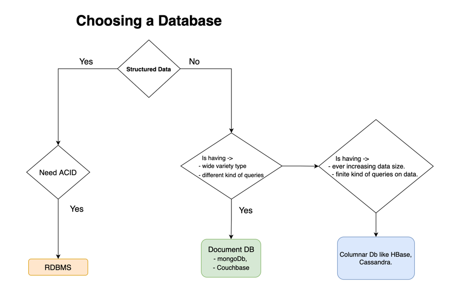

#### Introduction
Databases don't impact your functional requirement.  
you can meet your functional requirements using any database you want.  
But non-functional requirement are impacted by kind of database you choose and these include ->  
- certain kind of query pattern  
- certain kind of data structure  
- scale requirements - these are different kind of databases designed to handle different kind of scales.  

#### Factors impacting choice of database
1. structure of data  
2. query pattern  
3. amount of scale you need to handle.  

#### Caching solution
Whatever solution you choose in a System Design Interview, there is likely requirement for some kind of caching solution.  
Use cases here include ->  
- you are querying a database, and you don't want to query it lots of time, you can cache your value in the cache.  
- if you are making remote call to a different service, and it is having high latency, you might want to cache the response of that system locally in a caching solution.  

Cache normally includes key and a value.  
key = your predicates that are in the WHERE clause in your query  
Value = response you are expecting form the service  

common solution - redis, memcache.  
Redis - battle tested for use as caching.  

#### Blob storage
Suppose you want to store images for amazon ecommerce website or netflix video.  
In this case, you use blob storage like amazon S3.  
Note - this is not really a database, since in a database you generally query your data. This is plain storage case.  
Now, along with S3 you would want to include CDN (Content delivery network). CDN is used to distribute the same image geographically in lot of locations.  
eg - product image is stored in s3 which is being queried or accessed by people across the globe. So for betetr performance, you can store it locally in their geography for faster response times.  
So, to summarize, for Blob kind of content - S3 + CDN.  

#### Search Engines
If you are building a product like Amazon and you want to provide text searching capabilities on various products.  
So, seller has uploaded product along with Title and Description.  
Now, you would want users to be abel to search that product by providing text of the title and description.  
Likewise, users in Netflix want to search movie name, movie titles, movie genres, etc.  
Similarly, you want to deisgn something like Google Maps where you want ot provide text searching capabilities with support for Fuzzy Search.  
So, for all of these use cases, you would be using Text Search Engine.  
Common ones are Elastic Search and Solr, and both are built on top of Apache Lucene.  
Lucene fundamentally provides text searching capabilities.  

Fuzzy Search - suppose you are providing text search capabilities, and user makes a typo.  
for example - Instead of _AIRPORT_, he types _AIRPROT_  
Now, you wouldn't want to return null as it distorts user experience.  
Instead, you would want to return closest option based on Edit distance.  
for example, AIRPROT can be converted to AIRPORT by interchanging 'R' and 'O' - they are at edit distance of 2.  
So you can provide a level fuzziness factor that your search engine needs to support.  

One thing to note is that ElasticSearch and Solr are not databases. These are Search Engines.  
Why important ->  
Whenever you write something in a Database, your database gives you a guarantee that data wouldn't be lost.  
Now, both of these Search Engines don't give such guarantee. They claim that they are giving a good enough availability and redundancy, but potential data could be lost.  
So, you should NOT keep any of these as your primary sources of Truth.  
Your primary data source should be somewhere else, and you could load your data into either of these systems to provide searching capabilities and these 2 are very efficient at search.  

#### Time Series Database
If your want to store metrics kind of data.  
Say you are building a system like graphite, grafana, prometheus.   
These are Application Metrics Tracking systems.  
Let's say we have a use case wherein there arr lot of applications which are pushing metrics related to their Throughput, CPU utilization, Latencies, etc   
And you want to build a system to support that.  
Here we use Time Series Database.  
Think of time series database as an extension of relational database but with not all functionalities and certain additional functionalities.  
Regular databases have ability to update  records and query random records.  
but whenever you are building a metrics kind of system, you never do random updates. You always do sequential updates, in append-only mode.  
Also, the read queries that you do, they are kind of bulk queries with the time range - last hour, last day, last week data etc.  
But you don't do a random read or random update.  
Time series databases are optimized for this kind of query pattern and input pattern.  
So, there are a lot of time series databases like influxDB, openTS db (open time series database).  

Suppose you want to write lots of information, and you want store that info for various kind of analytics requirements.   
Eg - amazon or uber - analytics on all transaction.  
So, you would need a data warehouse, which is basically a large database wherein you push your data and provide querying capabilities on top of your data to service lot of reports.  
Now, these are generally  not used fo transactional systems.  
They are used for offline reporting.  
eg - hadoop, redshift.  

#### SQL Vs NoSQL : which one to choose?
  
Now, lets discuss on bigger scenarios wherein your want to choose between a relational and non-relational databases, i.e. SQL vs NoSQL.  
You need to ask 'what is structure of my data?' If structured info - choose RDBMS.  
For example, User Profile - name, age, address. These are standard information that every person would have, and so can use RDBMS.  

Suppose your data is structured, next question that comes up is that 'do you need ACID guarantees?'  
If yes, then RDBMS like Oracle, postgres, SQL Server, etc would suit.  
For example - bank transaction -> Here every transaction would have 2 components - credit and debit, and both should happen - in one account money is debited and in another account money is credited.  
Further, you would want that when user checks balance, they should reflect the latest correct value. Here consistency is important.  
Likewise, for Inventory management system and Order Management System, we need ACID guarantees.  

Now lets you have relational data, but you don't need ACID guarantees.  
That is, there is no use case of atomicity requirements.  
You could choose either relational or non-relational database, it wouldn't make much of a difference.  
Normally you would be able to map a structured data into a NoSQL model.  
so, either of these scenarios would be fine.  

Now, lets say you do not have structured data, then what do you do?  
There are a bunch of scenarios where your use case might fit in.  
These include ->  
    a. document DB  
    b. columnar Db  

##### Document DB
Suppose you are trying to build catalogue kind of system for an e-commerce website like amazon which has information of all items available on that platform.  
Here each item would have certain kind of attributed, which may or may not overlap with other items.  
e.g. -shirt (size, color) vs refrigerator (volume, power saving rating) Vs Milk (quantity, expiry date).  
Normally you would to store this info in JSON and dump into a database.  
But you would also would want ot query it.   
Now, querying on JSON is a bit tricky in relational databases.  
But there are certain kinds of database that are optimized for these kinds of queries.  
These are databases where you have a lot of data not just in terms of volume, but in terms of structure so you have lot of attributes and wide variety.  
Here you need documentDB.  
There arr lot of providers of DocumentDb like MongoDB, Couchbase.  
earlier we looked at elastic search and Solr for text searching - these are special cases of document databases.  
Now, lets say you don't have relational data and you also don't have complex queries, you could still use document DB, provided your use case doesn't fall into Columnar db category discussed below.  

##### Column Database
Let's say you have an ever-increasing data.  
eg - uber - driver of uber are continuously sending location, and you have use case of managing this ever-increasing data - however number of queries are finite.  
Here we use columnar database like HBase, Cassandra.  
Note - Cassandra is easier to deploy unlike HBase (which is coupled with Hadoop), so may prefer Cassandra.  

Often there is no single database that can fit your design.  
Consider amazon inventory - when you are managing inventory on that side, you need to make sure you are not overselling any item.   
Say you have only 1 quantity of an item, and there are 10 users who want to buy it, then you want to have there is ACID property so as to ensure there is only 1 of the user to commit the transaction, and other user should not be able to commit the transaction.  
Here it would make sense to use an RDBMS.  
But data in Amazon is ever-increasing data, and as it grows you cannot purge it since there are often legal restrictions in terms of purging the older data.  
So, instead we use Cassandra along with RDBMS.  
Here we keep details of order until it is delivered in RDBMS, and post that the corresponding info gets moved to Cassandra, and entry is removed from RDBMS.  

Consider another example - here you want to find sale of sugar in last 5 days.  
Now, sugar is not a brand. It is a category and has different variety, and this info is available in document database like MongoDb, wherein there is info about userId and corresponding order info and you extract list of all users who purchase sugar in last 5 days.  
Now, use this list to query RDBMS (for latest orders) and Cassandra(for older info).  
So, here we are using all the 3 systems, in combination to provide various querying capabilities.  

Credits : [CodeKarle](https://www.youtube.com/watch?v=cODCpXtPHbQ)  
Credits : [Sandeep Kaul](https://www.linkedin.com/in/sandeep1904/)  

