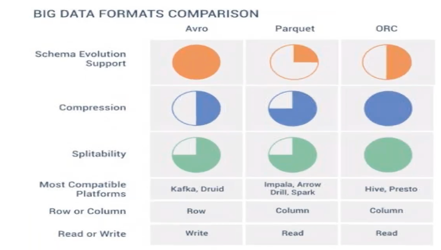

## Avro, ORC and Parquet

There major ones that work well with Big Data Environment are –  
•	Avro  
•	Orc  
•	Parquet  

All of above are –  
•	Splittable
•	Agnostic compression -   Any compression can be used with them, without readers having to know the codec.   This is possible because codec is stored in the header metadata of the file format.  
Reader needn’t know in advance what kind of compression technique is used with these files.   Compression codec is kept in file metadata, and whenever reader wants to read the data, he gets to know compression codec from metadata and can easily read the data.  

Avro File Formats  
1.	It is a row-based file format – data is stored row-by-row.  
So, it supports faster writes, but slower reads (when you want to read a subset of columns).  
2.	Self-describing schema - Schema is stored in JSON format and this metadata is embedded as part of data itself.  
3.	Actual data is stored in Compressed Binary format, which is quite efficient in terms of storage.  
4.	Language Neutral - Avro file format is general file format, and supports processing using lot of programming languages like C++, java, Python, Ruby, etc  
5.	Schema Evolution – Avro is quite mature in terms of schema evolution as compared to other file formats. Schema evolution includes aspects like –  
a.	Adding new columns  
b.	Removing old column  
c.	Renaming columns, etc  
6.	Splittable – file can be divided into parts which can be processed independently.  

Avro is a Serialization format.  
Serialization – converting data into a form which can be easily transferred over a network and stored in a file system.  
Deserialization – reading data and converting it into form which can be read by human.   

In which scenario, Avro is best suited –  
•	For storing data in **landing zone of data lake** – why –  
o	In lake, chances are different team requiring raw data, and since Avro is language neutral, so different teams can use it.  
o	In lake, data is unprocessed, that is no ETL done. For ETL kind of operations, we tend to read whole row and not a subset of it, and here again Avro is suited.  
	KL – in dh, we read only subset of data in lake to build warehouse. So, this point is debatable.   
o	Finally, in lake, data schema evolves over time, and so Avro is suited for handling Schema evolution.  
•	Avro is typically the format of choice for write-heavy workloads given it is easy to append new rows.  

**Avro Vs Orc**  

|Category| Avro                                                        | Parquet                                                                     |
|--------|-------------------------------------------------------------|-----------------------------------------------------------------------------|
|format| 	row based                                                  | 	column based                                                               |
|reads	| slower reads	                                               | faster reads - so useful for analytical querying                            |
|writes	| faster writes -  so suited to ETL operations.| 	slower writes                                                              |
|schema evolution| 	it is quite mature wrt Schema Evolution                    | 	Limited schema evolution support - you can add/delete column from the end. |
|complex data types| 	No such support.                                           | 	Provides support for deeply nested data structure.                         |

**Orc Vs Parquet**

|Category| Orc                                                                                                            | Parquet           |
|--------|----------------------------------------------------------------------------------------------------------------|-------------------|
|format| 	column based	                                                                                                 | column based      |
|predicate push down| 	provides predicate push down to push the predicates at storage level - that allows us to query relevant data. | 	 No such support |
|ACID properties| 	Now supports ACID properties to an extent.	                                                                   | No such support.  |
|Compression| 	Better - has lot more encodings used as compared to parquet.	                                                 | good              |
|complex data types	| No such support.                                                                                               |	Provides support for deeply nested data structure.|

