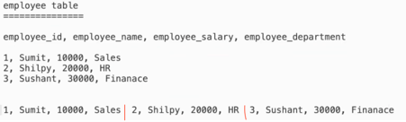
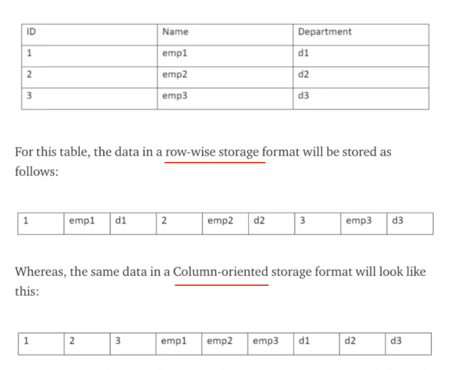

## Row Vs Column File Format
When you are designing big data solution, one fundamental que is – “how data will be stored”  
It involves taking into consideration 2 things –  
•	File formats  
•	Compression techniques  

Why do we need different File Formats?  
•	To save storage  
•	To do fast processing   
•	To have less time in I/O operations – since we are dealing in big data, I/O operations are a big bottleneck, and so spending as less time in this area as possible.  

Our file formats help us in all 3 above if we go with right file format.  

There are a lot of choices available on file formats.   
Below are key aspects for deciding a file format -   
1.	Faster reads.  
2.	Faster writes.  
3.	Splittable - Some are designed in such a way that they are splittable – if a file is splittable, we can do parallel processing – in big data solutions, we consider only splittable file formats.  
4.	Schema evolution support – some of the file formats support schema evolution -  i.e. to facilitate change in input data by allowing schema changes.  
5.	Advanced compression techniques  
6.	Most compatible platform - some work well with hive, some with spark, etc  

All the file formats have been divided into 2 broad categories –  
•	Row based  
•	Column based  

Row based –  
Here data is stored row-by-row.  
  

At a time, whole record is saved.   If a new record comes, it gets appended at the end.  
So, writing a record is very easy coz you simply append at the end.

Now let’s talk about reading –   
While write is easy, but in order to get subset of columns, it has to read entire record. That is, performance is degraded when it comes to read.  
In data warehousing, wherein we scan specific set of records, row-based formats is not suggested.  

Regarding Compression of row-based file–  
Since data is stored record by record, so different data types are present together, next to each other.  
That means, compression is not as efficient as it could be.  

Column based file format –  
All column values are stored together.  
  

For Reading data in column-based file format – it allows us to skip data and read only relevant columns.  
Column based file format is suggested for data warehouse based query system.  

For write on column-based file, it is time consuming as you need to write on multiple places.  

Regarding Compression of column-based file–  
Since data is stored column by column, so same data types are present together, next to each other.  
That means, compression can be applied efficiently for each data type.  
  

To summarize –  
If you write once but read multiple times, go for column-based file format.  
If you read once, but write multiple times, go for row-based file format.  

| Category              | row based	     | column based   |
|-----------------------|----------------|----------------|
| read                  | slower reads   | faster reads   |
| writes                | 	faster writes | 	slower writes |
| compression| 	poor	| good           |

