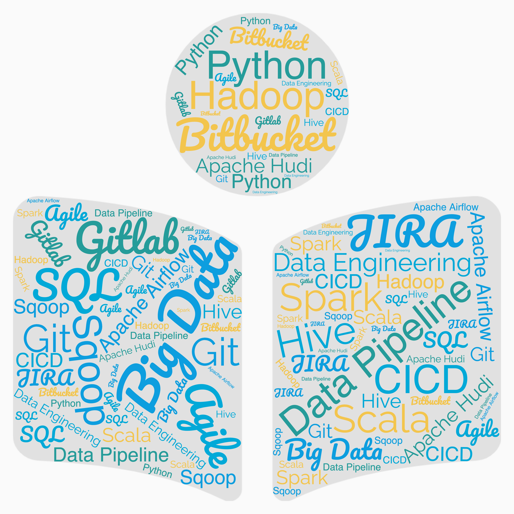

## About me 

Kushal is currently Lead Engineer at Airtel Africa Digital Labs (BigData & Analytics Team). 
He is the Lead for Business Intelligence product, which is being built from scratch, and is aimed to be scalable (handles data that can be in Gigabytes and Terabytes) and replicable across 14 OpCos. 

Efficient team leader and mentor with a history of managing multiple squads.   

Expert in providing data driven strategic approach and creating reusable and scalable models.   

Building strategic assets to set up a long term sustainable operational and capability model in technology strategy arena.  

He has extensive experience that spans across various technologies, including Python, Spark(PySpark), SQL, Hive, Hadoop, Apache Hudi, Airflow, Sqoop, Gitlab, BItBucket, CICD.  

He also has experience of migrating Data Solutions on legacy system to Big Data Stack. 
He has built data pipelines from scratch, with focus on data frameworks. 

Domain : Retail and Telecom 
Distributed Computing: Hadoop, HDFS, Yarn, Spark 
Programming Languages: Python, Scala 
Operating System: Linux, Unix 
Development Tools: JIRA 
Databases: Postgres, MongoDB, Oracle Exadata 
Methodologies: Agile/Scrum 

**Open to hearing about exciting information/opportunities in meaningful industries, more tech connections and both mentor/mentee relationships.** 