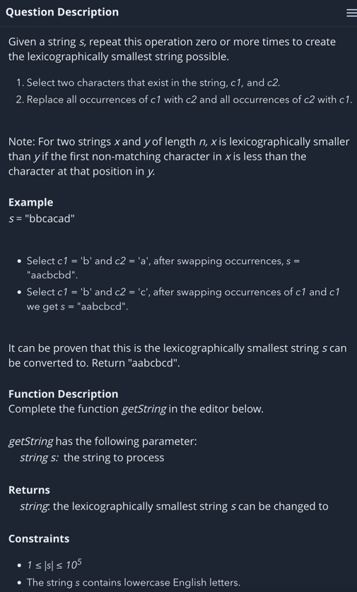
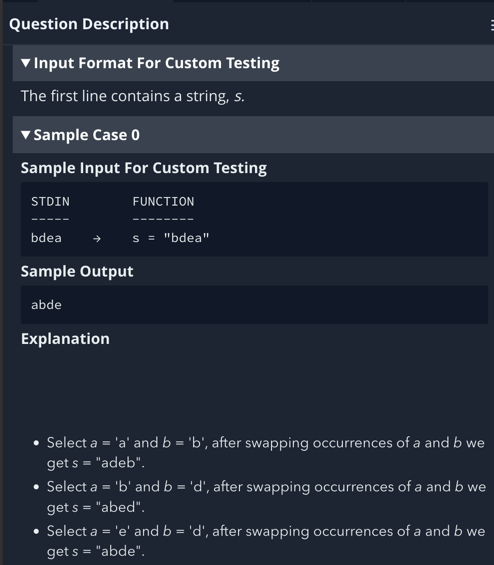
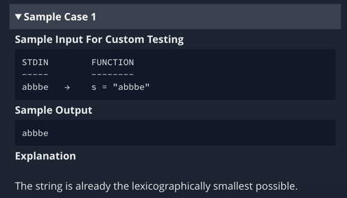

#### Expedia ML Engineer Round 1
Q1 - Find the largest number that can be formed with the given digits <br>
``` 
# Find the largest number that can be formed with the given digits.
# Input = [4, 7, 9, 2, 3]
# Output: 97432 

# Input = [8, 6, 0, 4, 6, 4, 2, 7]
# Output: 87664420
```
 <br> <br>

Q2 <br>
 <br>
 <br>
 <br>