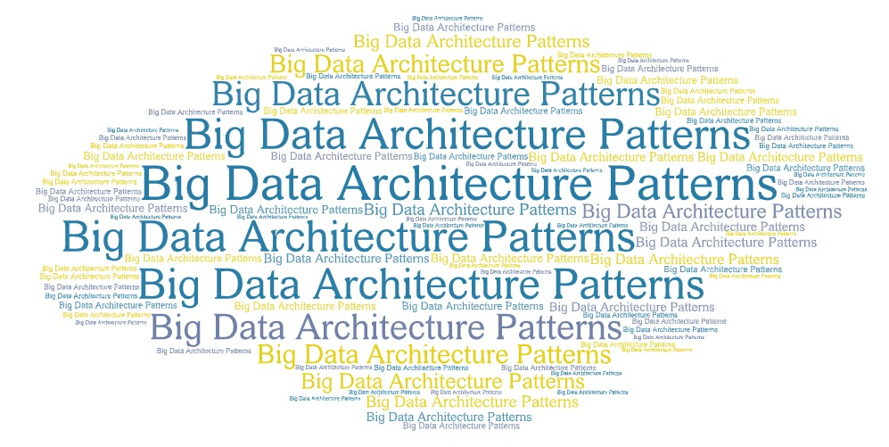

# Welcome to Big Data Architecture

## Topics
Big data Architectural Patterns  
- [Introduction](Big-data-architectural-patterns/Big-data-architectural-patterns-1.md)  
- [Big Data Architectural Principles](Big-data-architectural-patterns/Big-data-architectural-patterns-2.md)  
- [Data Collection Layer](Big-data-architectural-patterns/Big-data-architectural-patterns-3.md)  
- [Data Processing Layer](Big-data-architectural-patterns/Big-data-architectural-patterns-4.md)  
- [Data Consumption Layer](Big-data-architectural-patterns/Big-data-architectural-patterns-5.md)  
- [Putting it all together](Big-data-architectural-patterns/Big-data-architectural-patterns-6.md)  
- [Design Patterns](Big-data-architectural-patterns/Big-data-architectural-patterns-7.md) 

Storage Layer  
- [Row-based Vs Column-based File Formats](Storage Layer Choices/row based and column based file formats.md)  
- [Text-based File Formats](Storage Layer Choices/Text File Formats.md)  
- [Big Data File Formats](Storage Layer Choices/big data file formats.md)  
- [File Compression Techniques in Big Data Systems](Storage Layer Choices/File Compression techniques in Big Data.md)  

HBase  
- [Why HBase? ](HBase/Why HBase.md)  

Case Study   
- [IHS Markit System Design Case Study (2020)](case study/IHS-Markit-System-Design.md)  
- [ZS Associates Data Consultant System Design Case Study (2020)](case study/ZS-Associates-Data-Consultant-Case-Study.md)  
- [Interview Questions](case study/Sample-Questions-System-Design.md)
   
**Author** : [Kushal Luthra](aboutme.md)  
**repo url** : https://github.com/kushal-luthra/big-data-architecture